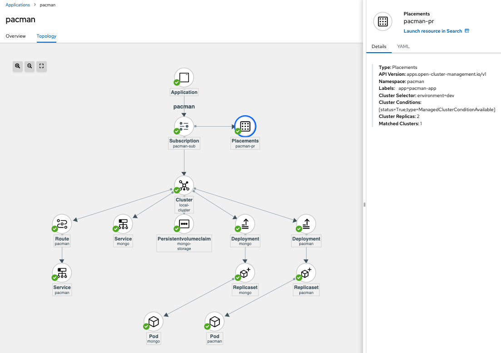
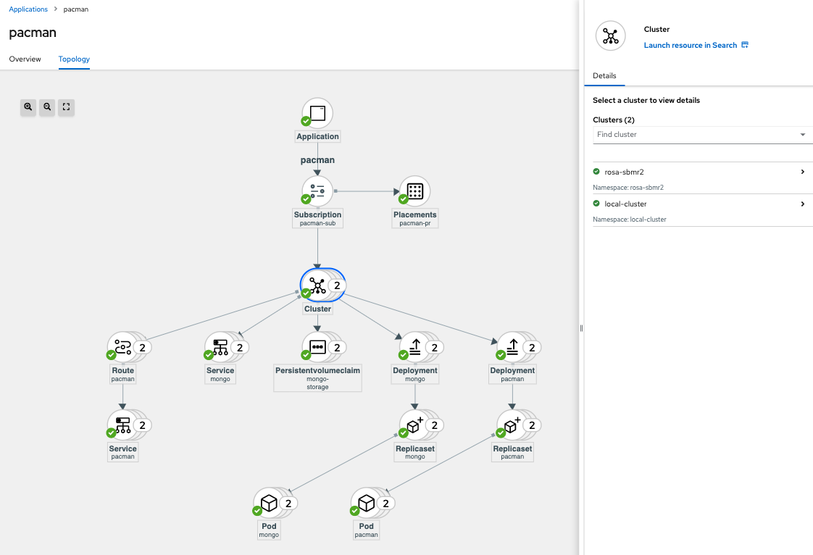

## From Zero to Hero using GitOps - MultiCluster GitOps with ACM 

### Prerequistes

* ACM Hub
* Local Cluster Tagged with "environment=dev"
* Managed cluster

* Checkout to this specific branch

```
git checkout acm-gitops
```


### Deploy Applications in the Local Cluster using ACM GitOps

* In the ACM Hub apply the ACM CR objects for managing GitOps using ACM:

```sh
kubectl apply -k pacman-app/acm-resources/
```



* The PlacementRule matches with the labels of the Local Cluster (ACM Hub) "environment=dev":

```sh
kubectl get managedcluster local-cluster -o jsonpath='{.metadata.labels}' | jq -r . | grep environment
  "environment": "dev",
```

### Scale to Multiple Clusters using ACM GitOps

* Label the Managed Cluster with the label "environment=dev"

```sh
kubectl label managedclusters rosa-sbmr2 "environment=dev" --overwrite
```



* The PlacementRule matches with the labels of one of the ManagedClusters "environment=dev":

```sh
kubectl get managedcluster rosa-sbmr2 -o jsonpath='{.metadata.labels}' | jq -r . | grep environment
  "environment": "dev",
```