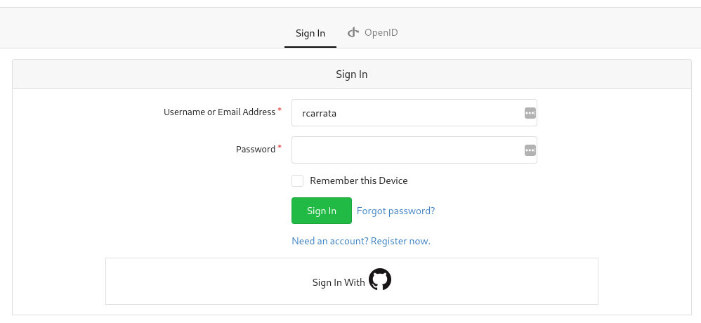
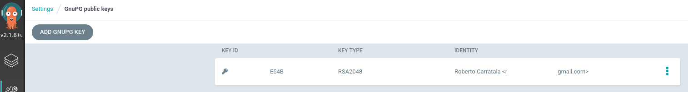
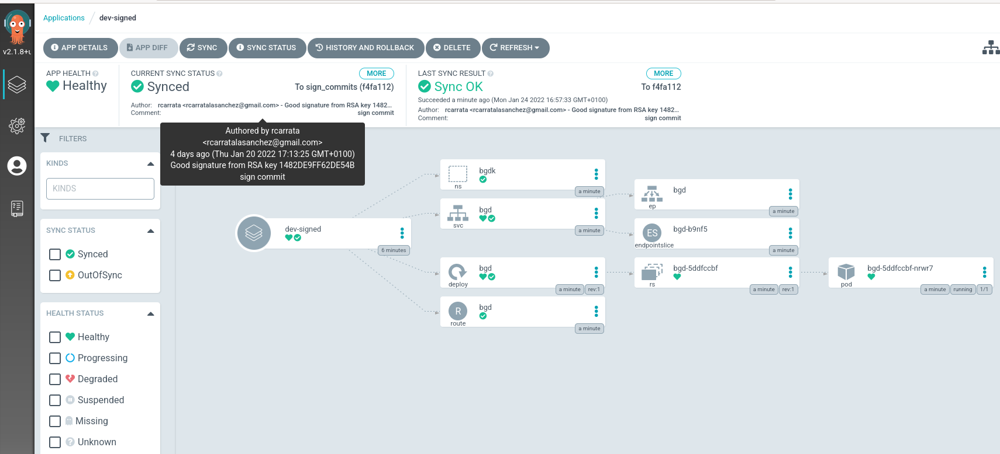
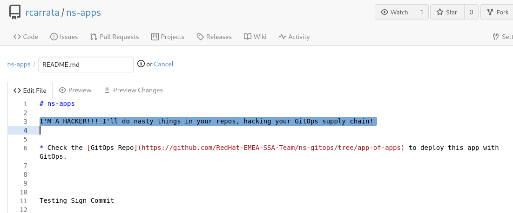
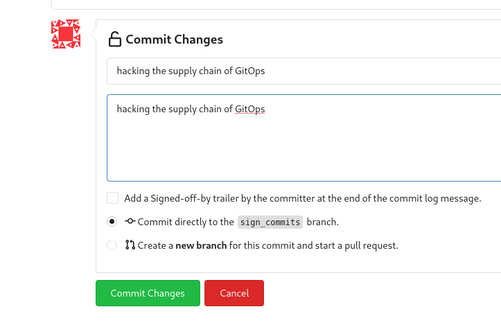
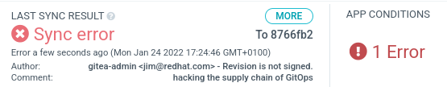
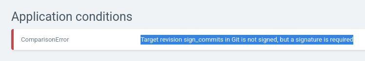

# Secure GitOps supply chain with GnuPG signature verification in ArgoCD

As of v1.7 it is possible to configure ArgoCD to only sync against commits that are signed in Git using GnuPG. Signature verification is configured on project level.

If a project is configured to enforce signature verification, all applications associated with this project must have the commits in the source repositories signed with a GnuPG public key known to ArgoCD.

ArgoCD will refuse to sync to any revision that does not have a valid signature made by one of the configured keys. The controller will emit a ResourceComparison error if it tries to sync to a revision that is either not signed, or is signed by an unknown or not allowed public key.

By default, signature verification is enabled but not enforced.

Verification of GnuPG signatures is only supported with Git repositories. It is not possible using Helm repositories.

## 1. Deployment of a Gitea Server in Kubernetes / OpenShift

We will use [Gitea Server](https://gitea.io) as our Git Server deployed in Kubernetes / OpenShift cluster. Gitea is a community managed lightweight code hosting solution written in Go.

## 1. Deploy Gitea Environment in Kubernetes using Helm

* Get the Helm Chart of Gitea:

```sh
git clone https://github.com/rcarrata/rcarrata-charts.git
cd charts/
```

* Deploy the Helm Chart of Gitea in your cluster

```sh
helm upgrade --install gitea --create-namespace -n gitea gitea/ --set db.password=redhat --set hostname=gitea.xxx.xxxx.xxx.com
```

We can use also the [Gitea Upstream Chart](https://gitea.com/gitea/helm-chart/), in this case we've used this adapted chart for deploy into OpenShift, but you can use the official one as well in your K8s/OCP clusters.

* Check that the Helm Chart of Gitea have been deployed properly:

```
kubectl get pod -n gitea
NAME                READY   STATUS      RESTARTS   AGE
gitea-1-deploy      0/1     Completed   0          3m48s
gitea-1-zrpcz       1/1     Running     0          3m48s
gitea-db-1-deploy   0/1     Completed   0          3m49s
gitea-db-1-h8w65    1/1     Running     0          3m48s
```

### 1.1 Configure the users and tokens in Gitea

Before to start playing with GPG Keys and Gitea, we need to set up the proper user / tokens and permissions.

* Let's generate the Gitea Admin user for manage our Gitea Server from the console. Generate a gitea-admin user with admin privileges:

```sh
export gturl=https://$(kubectl get route -n gitea gitea -o jsonpath='{.spec.host}')

kubectl -n gitea exec -ti $(kubectl get pod -n gitea -l deploymentconfig=gitea --no-headers=true | awk '{ print $1 }') -- giteacmd admin user create --username gitea-admin --password redhat --email jim@redhat.com --admin
```

NOTE: Due to https://github.com/go-gitea/gitea/issues/5376 issue is not possible to generate first user by api

* Generate and get the gitea-admin Application token:

```sh
export gtadmin="gitea-admin"
export gtpass="xxx"
TOKEN=$(curl -s -X POST https://${gturl}/api/v1/users/${gtadmin}/tokens -u ${gtadmin}:${gtpass} -H "Content-Type: application/json" -d '{"name": "admintoken"}' -v | jq -r .sha1)
```

* Generate new regular user non-admin:

```sh
export gtuser="rcarrata"
export gtpass="xxx"
export gtemail="xxx@gmail.com

curl -s -X POST ${gturl}/api/v1/admin/users \
-H "accept: application/json" \
-H "Authorization: token ${TOKEN}" \
-H "Content-Type: application/json" -d \
"{\"email\":\"${gtemail}\",\"login_name\":\"${gtuser}\",\"must_change_password\":false,\"password\":\"${gtpass}\",\"send_notify\":false,\"username\":\"${gtuser}\"}"

```

IMPORTANT: the gtemail / email used here, MUST be the same as your will have within your GPG Keys because will be checked afterwards when we add the public GPG keys within the Gitea Server:

* Get user Id of the regular user:

```sh
export GTUID=$(curl -s -X GET ${gturl}/api/v1/users/${gtuser} -H "accept: application/json" -H "Authorization: token ${TOKEN}"  | jq -r .id)
```

* Migrate repos from the github repo to the Gitea Server:

```sh
for repo in https://github.com/RedHat-EMEA-SSA-Team/ns-gitops https://github.com/RedHat-EMEA-SSA-Team/ns-apps
do
	reponame=$(basename ${repo})
	echo "Migrating Repo - ${reponame}"
	echo "============================"
	curl -s -X POST ${gturl}/api/v1/repos/migrate \
	-H "accept: application/json" \
	-H "Authorization: token ${TOKEN}" \
	-H "Content-Type: application/json" -d \
	"{\"clone_addr\":\"${repo}\",\"description\":\"\",\"issues\":false,\"milestones\":false,\"mirror\":false,\"private\":false,\"repo_name\":\"${reponame}\",\"uid\":${GTUID}}"
done
```

* Create developer token to use them in steps after:

```sh
export DTOKEN=$(curl -s -X POST ${gturl}/api/v1/users/${gtuser}/tokens -u ${gtuser}:${gtpass} -H "Content-Type: application/json" -d '{"name": "develtoken"}' | jq -r .sha1)
```

### 1.2 Configure the GPG Keys and link them within Gitea

Now that we have all the users / permissions / tokens ready, it's time to generate the GPG keys and sync within the Gitea Server.

* [Generate the GPG keys](https://docs.github.com/en/authentication/managing-commit-signature-verification/generating-a-new-gpg-key) in your laptop.

* Extract the ID of your gpg key generated and associated with your uid and email:

```sh
KEY_ID=$(gpg --list-secret-keys --keyid-format=long | grep sec | cut -f2 -d '/' | awk '{ print $1}')
```

* Export your GPG Keys:

```
gpg --armor --export $KEY_ID | xclip
```

NOTE: if you have not installed xclip you can copy & paste the gpg public key directly in the Gitea Server console.

* Go to the gitea website deployed in your OCP/K8s cluster:

```sh
echo $gturl

https://gitea.xxx.xxxx.xxx.com
```

* Login with the user / password generated in the step before (gtuser and gtpass):



* Go to the Settings -> SSH/GPG Keys and Add New GPG Keys:


## 1.3 Configure and Sign Commits in our Repo in Gitea Server

Now that we had setup the GPG Keys, it's time to sign our commits with our GPG Keys and check if we have this signature verification in our Gitea repo server.

* Download the repository forked to the Gitea Server to introduce a change:

```
git clone https://gitea.xxx.xxx.xxx.com/rcarrata/ns-apps.git
git checkout sign_commits
```

* We need to tell git about the gpg key. Let's set the GPG Key for Git with:

```sh
git config --global user.signingkey $KEY_ID
```

NOTE: For more information about this check [Telling Git about your GPG key
documentation](https://docs.github.com/en/authentication/managing-commit-signature-verification/telling-git-about-your-signing-key#telling-git-about-your-gpg-key-2)

* Introduce a change in the repo, and add this file into the commit:

```sh
echo "Testing Sign Commit" >> README.md

git add .
```

* Add a commit signed with your gpg key:

```
git commit -S -am "sign commit"
[sign_commits 04acee6] sign commit
 1 file changed, 1 insertion(+)
```

NOTE: With the flag -S the git commit command will be signed with the GPG key designed in the previous step.

* Push the changes to the Gitea Server:

```sh
git push
```

NOTE: the credentials will be asked, use the gtuser and gtpass credentials used to generate the user.

* Check in the Gitea server that the commit is properly signed with the GPG key, imported in the early steps:


* Click on the specific commit signed for get more details:


With that, we tested that we can sign commits with our GPG keys in our laptop and we can have the signature verification in a Git server (Gitea), ensuring that the commit was signed from a valid user with the proper GPG keys.

## 2. Deploy ArgoCD / OpenShift GitOps:

Now we need to deploy an instance of ArgoCD or OpenShift GitOps. For that:

* We need to install OpenShift GitOps in the ACM Hub with the Operator. You can follow the [official documentation for OpenShift GitOps](https://docs.openshift.com/container-platform/4.9/cicd/gitops/installing-openshift-gitops.html).

* On the other hand if you want to deploy the ArgoCD upstream, follow [Install ArgoCD upstream documentation](https://argo-cd.readthedocs.io/en/stable/getting_started/#1-install-argo-cd).

* Check that everything is ok with the OpenShift GitOps deployment:

```
kubectl get pod -n openshift-gitops
NAME                                                          READY   STATUS    RESTARTS   AGE
cluster-54b7b77995-85275                                      1/1     Running   0          41h
kam-76f5ff8585-gz6s4                                          1/1     Running   0          41h
openshift-gitops-application-controller-0                     1/1     Running   0          41h
openshift-gitops-applicationset-controller-6948bcf87c-hbwdh   1/1     Running   0          41h
openshift-gitops-dex-server-6b499dbfb6-cvkmx                  1/1     Running   0          41h
openshift-gitops-redis-7867d74fb4-5r9nj                       1/1     Running   0          41h
openshift-gitops-repo-server-6dc777c845-dxxhf                 1/1     Running   0          41h
openshift-gitops-server-785b47d889-phrhp                      1/1     Running   0          41h
```

With that, we checked that our ArgoCD server is available to start doing GitOps cool stuff.

## 3. GnuPG signature verification in ArgoCD

As we described before, it is possible to configure ArgoCD to only sync against commits that are signed in Git using GnuPG. Signature verification is configured on project level.

If a project is configured to enforce signature verification, all applications associated with this project must have the commits in the source repositories signed with a GnuPG public key known to ArgoCD. ArgoCD will refuse to sync to any revision that does not have a valid signature made by one of the configured keys.

To configure enforcing of signature verification, the following steps must be performed:

1. Import the GnuPG public key(s) used for signing commits in ArgoCD
2. Configure a project to enforce signature verification for given keys

### 3.1 Import the GnuPG public key(s) in ArgoCD

Let's import our GPG public key for sign commits in our ArgoCD server.

* Extract the ArgoCD admin password and the full url of the ArgoCD server:

```sh
argoPass=$(oc get secret/openshift-gitops-cluster -n openshift-gitops -o jsonpath='{.data.admin\.password}' | base64 -d)

argoURL=$(oc get route openshift-gitops-server -n openshift-gitops -o jsonpath='{.spec.host}{"\n"}')
```

* Login to the ArgoCD instance with the argocd cli:

```sh
argocd login --insecure --grpc-web $argoURL  --username admin --password $argoPass
'admin:login' logged in successfully
```

* Listing all configured keys:

```sh
argocd gpg list
```

* Export the public GPG key selected associated with the proper email:

```
cd ~/.gnupg
gpg --output public.pgp --armor --export xxx@mail.com
```

* To import a the public GPG key to ArgoCD server:

```
argocd gpg add --from ~/.gnupg/public.pgp
```

* Check that the public GPG key is imported in the ArgoCD server:



After we have imported a GnuPG key, it may take a while until the key is propagated within the cluster, even if listed as configured.

NOTE: Also you can [Manage Public GPG Keys in declarative setup](https://argo-cd.readthedocs.io/en/stable/user-guide/gpg-verification/#manage-public-keys-in-declarative-setup) to manage your own public keys within your Git repository.

* After the uploading the keys with the argocd cli or with declarative setup we will have in the ArgoCD namespace, a ConfigMap resource with the public GnuPG key's ID as its name and the ASCII armored key data as string value:

```sh
kubectl get cm -n openshift-gitops argocd-gpg-keys-cm

NAME                 DATA   AGE
argocd-gpg-keys-cm   1      5m12s
```

NOTE2: In this case because we've used OpenShift GitOps, we will have in that namespace, but in upstream we will have the argocd namespace as well)

## 3.2 Configuring an ArgoCD Project to enforce signature verification

Once we have imported the GnuPG keys to ArgoCD, we must now configure the project to enforce the verification of commit signatures with the imported keys in the early step.

We can configure the ArgoCD projects in several ways, using the CLI, the console or in a declarative way.

Let's use the declarative way to show how to define an ArgoCD Project with the GPG keys assigned.

* Define an ArgoCD Project with the signatureKeys defined, specifying the KeyID from our GPG obtained in early steps:

```sh
cat argo-projects/apps-project.yaml

apiVersion: argoproj.io/v1alpha1
kind: AppProject
metadata:
  name: gpg-project
  namespace: openshift-gitops
spec:
  clusterResourceWhitelist:
  - group: '*'
    kind: '*'
  description: GnuPG verification
  destinations:
  - namespace: '*'
    server: '*'
  namespaceResourceWhitelist:
  - group: '*'
    kind: '*'
  signatureKeys:
  - keyID: xxxxE54B
  sourceRepos:
  - '*'
```

* Apply the Argo App Project definition:

```sh
kubectl apply -k argo-projects

appproject.argoproj.io/gpg-project created
```

* Check the ArgoCD App Projects generated within our ArgoCD cluster:

```
kubectl get appproject -A
NAMESPACE          NAME          AGE
openshift-gitops   default       5d16h
openshift-gitops   gpg-project   30s
```

* Check the ArgoCD AppProject signatureKeys, to check that we defined properly the signature Keys and it's reflected in the App Project:

```sh
kubectl get appproject -n openshift-gitops gpg-project -o jsonpath='{.spec.signatureKeys}'

[{"keyID":"xxxE54B"}]
```

### 3.3 Deploying our workload using a ArgoCD enforcing signature verifications

If signature verification is enforced, ArgoCD will verify the signature using following strategy:

* If target revision is a pointer to a commit object (i.e. a branch name, the name of a reference such as HEAD or a commit SHA), ArgoCD will perform the signature verification on the commit object the name points to, i.e. a commit.

* If target revision resolves to a tag and the tag is a lightweight tag, the behaviour is same as if target revision would be a pointer to a commit object.

To keep this demo simple, let's stick with the target revision to a commit object using a branch name like HEAD.

Let's define our ArgoApp that will use the repo forked in our Gitea Server and the Argo Project that enforces the signature verification:

```sh
cat argo-apps/dev-signed.yaml

apiVersion: argoproj.io/v1alpha1
kind: Application
metadata:
  name: dev-signed
  namespace: openshift-gitops
spec:
  destination:
    namespace: openshift-gitops
    server: https://kubernetes.default.svc
  project: gpg-project
  source:
    path: apps/bgd/overlays/bgdk
    repoURL: http://gitea.apps.xx.xxx.com/gitea/ns-apps
    targetRevision: sign_commits
  syncPolicy:
    automated:
      prune: true
      selfHeal: false
    syncOptions:
    - CreateNamespace=true
```

as we can check this ArgoApplication will use as source the repository forked in the Gitea server, will use the **gpg-project** that enforces the GPG signature verification and it's using the targetRevision sign_commits.

We apply this Argo Application directly to our ArgoCD instance:

```
kubectl apply -k argo-apps/

application.argoproj.io/dev-signed configured
```

* After that the ArgoCD will apply the manifests that are located in the source repository in Gitea, in the branch of **sign_commits** that was signed with our GPG keys:



as we can check the ArgoCD application is checking the signature that have the commit against the signature defined in the Key ID of the Argo Project. If matches, as in this example, it will sync OK.

So we can ensure that it's me and not other person that signed that commit, and we ensure also that not wrong or malicious commits are pushed to our repository.

## 4. Ensuring that our GitOps deployment supply chain in ArgoCD is protected using GPG Signature Verification

In the step before we tested that our GitOps repository was synched and our application in the repository that ArgoCD application used as a source to deploy the workload used properly the signature verification of the GPG signed commits.

Now it's the turn to show how Argo GPG Signature Verification can help us to ensure that GitOps supply chain is secured.

* Login with the gitea-admin user in Gitea server, and let's introduce a change in the repository:



*  Let's commit the changes introduced in the file, hacking our supply chain and introducing malicious code:



in this case it's a message, but imagine that changes something critical in your production app, or try to gain access to other tools / systems...

* If we check the repository, we can see that the commit was introduced by a the gitea-admin user and introduces something malicious:


NOTE: We could introduce a change in the repository because we used gitea-admin user, and was an admin user. Gitea by default secures the repositories from changes that are not from allowed users or maintainers of the repo.

* Let's check the ArgoCD Application if I introduced a change and it's synched properly:



The state of the ArgoCD Application was in Sync Error! What happened?

* As the message in the output revealed, the Argo Application failed to sync because the commit was not signed by the GPG Key expected, and shows:

```
Revision is not signed
```

* If we check more details about the status of the Last Sync we can see like we received a ComparisonError output:



The controller will emit a ResourceComparison error if it tries to sync to a revision that is either not signed, or is signed by an unknown or not allowed public key.

So we're saved, even if the hacker get's access to our repository to write any rogue or malicious commit, ArgoCD will enforce the GPG Signature Verification against the commit signed (or not), securying in that way the GitOps Supply Chain.
