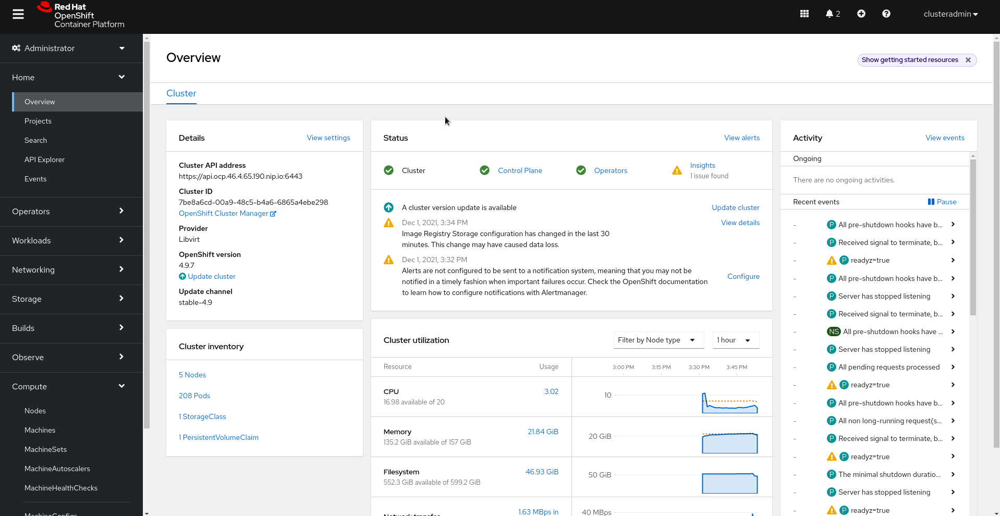

# Demo 7 - Implementing Network Security Zones in OpenShift


Application pods run on one OpenShift Cluster. Micro-segmented with Network Security policies.

Infra Nodes in each zone run Ingress and Egress pods for specific zones

If required, physical isolation of pods to specific nodes is possible with node-selectors. But that defeats the purpose of a shared cluster. Micro-segmentation with SDN is the way to go.

## Demo Environment provisioning

We will be using an example microservices, where we have two main namespace "Simpson" and "Bouvier"
and two microservices deployed in each namespace:


Marge and Homer microservices will be running in the Simpson namespace and Selma and Patty microservices will be running in the Bouvier namespace.

* Provision Namespace and ArgoProjects for the demo:

```sh
oc apply -k argo-projects/
```

NOTE: if you deployed in the early exercise this application, you can skip to the Egress Firewall step directly.

* Login to the ArgoCD Server:

```sh
echo https://$(oc get route openshift-gitops-server -n openshift-gitops -o jsonpath='{.spec.host}{"\n"}')
```

* Use admin user with the password:

```sh
oc get secret/openshift-gitops-cluster -n openshift-gitops -o jsonpath='\''{.data.admin\.password}'\'' | base64 -d
```

NOTE: you can also login using the Openshift SSO because it's enabled using Dex OIDC integration.

## Implementing Network Security Zones in OpenShift

In this demo we are going to host the Ingress Router in dedicated nodes (front-end nodes) along with the "patty" app, the "selma" app into the application nodes and the simpson app in the backend nodes.


The steps for this demo are:

1- Create new front-end and application nodes

2- Prepare the external connectivity

3- Create the Ingress Router and "patty" app into front-end nodes and move "selma" app to application nodes

4- Create the apps with the "patty" app into front-end nodes and move "selma" app to application nodes

5- Setup network policy rules


### Creating new front-end and application nodes

Nodes in OpenShift can be created in two different ways:

a) OpenShift control plane creates the new nodes

b) New nodes are created manually o through an external (to OpenShift) automation

If you deployed your OpenShift using any IPI installation method, you will have already setup the MachineAPI, which permits, thanks to an integration with the underlaying infrastructure, to create/delete new nodes on-the-fly.

In this example we'll be using MachineAPI, so we don't need to work "too much" bringing new nodes into our cluster.

We just need to add two more workers to our MachineSet, you can do it by editing the MachineSet Object. First determine the MachineSet name:

```sh
$ oc get machineset -n openshift-machine-api

NAME                 DESIRED   CURRENT   READY   AVAILABLE   AGE
ocp-8ncgh-worker-0   2         2         2       2           40m
```
And then patch or edit that object and add two to the replica number:

```sh
$ oc edit machineset ocp-8ncgh-worker-0 -n openshift-machine-api

...
spec:
  replicas: 6
  selector:
    matchLabels:
...
```

Or more easyly, using the Web Console:




BUT REMEMBER!, in that case, the new workers will have the same labels than the current ones, making it necessary to configure the labels to differenciate them as a post-step done manually. If you want to avoid that, so need to create a new MachineSet which will have the same node configuration (that could be also different) but that will include different labels.

In this demo we will use the "manual approach" to make this guide a little bit more light.

Labeling the new nodes is usefull since, for example, we can configure Tolerations and Taints to manipulate the Kubernetes scheduler and enforce, for example, that Ingress Controllers or applications can only be running in these new nodes

First check that the new nodes are part of the cluster:

```sh
$ oc get node

NAME                       STATUS   ROLES    AGE     VERSION
ocp-8ncgh-master-0         Ready    master   3h6m    v1.22.1+d8c4430
ocp-8ncgh-master-1         Ready    master   3h7m    v1.22.1+d8c4430
ocp-8ncgh-master-2         Ready    master   3h6m    v1.22.1+d8c4430
ocp-8ncgh-worker-0-27zvs   Ready    worker   3h      v1.22.1+d8c4430
ocp-8ncgh-worker-0-fngf2   Ready    worker   3h2m    v1.22.1+d8c4430
ocp-8ncgh-worker-0-gctph   Ready    worker   4m      v1.22.1+d8c4430
ocp-8ncgh-worker-0-nvt78   Ready    worker   3m59s   v1.22.1+d8c4430
ocp-8ncgh-worker-0-sz7qh   Ready    worker   3m57s   v1.22.1+d8c4430
ocp-8ncgh-worker-0-v644c   Ready    worker   3h2m    v1.22.1+d8c4430
```


Let's add a new label into these new nodes. We are going to use an special label which will configure a new "role" for those nodes. We are using this label to make it more "visual" but you can use the label of your preference.

Let's continue with our example, labeling the nodes using this command for the nodes that will be used as front-ends (one the node provisioning has finished):

```sh
oc label node <node-name> node-role.kubernetes.io/frontend-worker=''
```

An this one with the ones for the application layer:

```sh
oc label node <node-name> node-role.kubernetes.io/application-worker=''
```

With this change we are adding a new role to the nodes, but we are keeping the default "worker" role. If you want to go a step further into the segmentation it could be a good idea to remove the worker role and then differenciate these new nodes from the worker nodes at the configuration level (ie. different network setup).

_NOTE_: In that case you will need to create an additional MachineConfigPool to apply MachineConfigs to these nodes.

In this demo we are going to keep it simple and go ahead with the dual-role approach, 

Once you have include that label, you can see how these nodes get a new role:

```sh
$ oc get node

NAME                       STATUS   ROLES                       AGE     VERSION
ocp-8ncgh-master-0         Ready    master                      3h10m   v1.22.1+d8c4430
ocp-8ncgh-master-1         Ready    master                      3h10m   v1.22.1+d8c4430
ocp-8ncgh-master-2         Ready    master                      3h10m   v1.22.1+d8c4430
ocp-8ncgh-worker-0-27zvs   Ready    frontend-worker,worker      3h3m    v1.22.1+d8c4430
ocp-8ncgh-worker-0-fngf2   Ready    worker                      3h6m    v1.22.1+d8c4430
ocp-8ncgh-worker-0-gctph   Ready    frontend-worker,worker      7m40s   v1.22.1+d8c4430
ocp-8ncgh-worker-0-nvt78   Ready    application-worker,worker   7m39s   v1.22.1+d8c4430
ocp-8ncgh-worker-0-sz7qh   Ready    application-worker,worker   7m37s   v1.22.1+d8c4430
ocp-8ncgh-worker-0-v644c   Ready    worker
```

In addition to the label, we are going to configure "Taints", so only the applications with the specific "Tolerations" will be allowed to run on those nodes.

Any workload that does not have zone=frontend label won't be allowed to be scheduled in the frontend nodes, and same thing for the zone=application in the application nodes:


```shell
oc adm taint nodes ocp-8ncgh-worker-0-27zvs zone=frontend:NoSchedule
oc adm taint nodes ocp-8ncgh-worker-0-gctph zone=frontend:NoSchedule
oc adm taint nodes ocp-8ncgh-worker-0-nvt78 zone=application:NoSchedule
oc adm taint nodes ocp-8ncgh-worker-0-sz7qh zone=application:NoSchedule
```

Since the new IngressControllers will be running on the frontend workers, you must include the Tolaration in the openshift-ingress namespace
oc edit namespace openshift-ingress

```shell
$ oc edit namespace openshift-ingress
```


```yaml
...
  annotations:
    openshift.io/node-selector: ''
    openshift.io/sa.scc.mcs: 's0:c24,c4'
    openshift.io/sa.scc.supplemental-groups: 1000560000/10000
    openshift.io/sa.scc.uid-range: 1000560000/10000
    scheduler.alpha.kubernetes.io/defaultTolerations: '[{"Key": "zone", "Operator":"Equal", "Value": "frontend", "effect": "NoSchedule"}]'
  managedFields:
 ...
```


### Step 2: Preparing the external connectivity


We are going to create a new Ingress Router for the bouvier namespace similary as we did in [Demo 5 - Securing Ingress Traffic with Ingress Controllers and NodeSelectors using GitOps](https://github.com/RedHat-EMEA-SSA-Team/ns-gitops/tree/ingress). You can find a copy of the steps below.


For the new Ingress controller we need to complete two additioanl external configurations:

* We need to include a new subdomain that must be resolvable in the DNS

* We need to configure a way to reach out to the nodes that will host the new Routers.

The configuration of how we are reaching out to the new nodes will be different depending on the platform that you are using because when you deploy OpenShift in on-premise, if you don't use something like [MetalLB](https://docs.openshift.com/container-platform/latest/networking/metallb/about-metallb.html), you won't be able to use the LoadBalancerService type in your Kubernetes services (which it's useful to automate publishing of services running on Kubernetes).

In summary, if you deploy OpenShift in a Cloud, your Ingress Controller routers will be published directly in a Load Balancer using the LoadBalancerService, but if you don't have LoadBalancerService service type the Router will be published using HostNetwork, which means that you will need to configure the method to reach out to the nodes hosting the new Routers in addition to the DNS configuration.


You can check the publishing method by reviewing the default Ingress Controller, in this case we are using hostnetwork:

```shell
$ oc get pod -n openshift-ingress router-default-7869647cbd-48w5c -o yaml | grep -i hostnetwork

    openshift.io/scc: hostnetwork
        f:hostNetwork: {}
  hostNetwork: true
```

For this demo, we will make it easy and we are not going to configure any Load Balancer, but just a simple round-robin DNS resolution pointing to the IPs of the new nodes.

In order to know the IPs of the new nodes:

```shell
oc get node <node name> -o jsonpath='{.status.addresses}{"\n"}'
```

We configure a new `*.frontend.ocp.my.lab` wildcard subdomain in our DNS (ok, ok, you can make it even simplier configuring a simple `/etc/hosts` entry...) poiting to the IPs of the new nodes.


### Step 3: Creating the new Ingress Router 

Create the new Ingress Controllers along with some test routes:

```sh
oc apply -f argo-apps/seczones-frontend.yaml
```

It's important to understand a couple of point regarding these objects.

After the deployment of the new Ingress Controller, we will have to split the usage between the default and the new Ingress Controller. You can select the routes that will be published by an Ingress Controller in two ways:

* Using routeSelector: Users can use a label to choose when to publish the route in this Ingress Controller

* Using namespaceSelector: Certain namespaces with this label will always publish their routes in this Ingress Controller

In this demo we are going to use the labels `zone=frontend` as routeSelector.

If you want to take a look to the new Ingress, where it is included the subdomain along with the nodeSelector and the namespaceSelector:


```yaml
apiVersion: operator.openshift.io/v1
kind: IngressController
metadata:
  name: frontend-ingress
  namespace: openshift-ingress-operator
spec:
  endpointPublishingStrategy:
    type: HostNetwork 
  domain: frontend.ocp.my.lab
  replicas: 2
  nodePlacement:
    nodeSelector:
      matchLabels:
        node-role.kubernetes.io/frontend-worker: ""
  routeSelector:
    matchExpressions:
      - key: zone
        operator: In
        values:
        - frontend
```

You can check how the new router pods are created in the new front-end nodes:

```shell
$ oc get pods -n openshift-ingress -o wide

NAME                                       READY   STATUS              RESTARTS   AGE   IP               NODE                       NOMINATED NODE   READINESS GATES
router-default-5ff4dfcf6-6gc8g             1/1     Running             0          14h   192.168.126.52   ocp-xtxqn-worker-0-xq7jh   <none>           <none>
router-default-5ff4dfcf6-tjnh8             1/1     Running             0          33m   192.168.126.51   ocp-xtxqn-worker-0-x2zsg   <none>           <none>
router-ingresscontroller-c58d9bff6-8w972   0/1     ContainerCreating   0          3s    192.168.126.54   ocp-xtxqn-worker-0-8c6mc   <none>           <none>
router-ingresscontroller-c58d9bff6-gnccv   0/1     ContainerCreating   0          4s    192.168.126.55   ocp-xtxqn-worker-0-mfp6q   <none>           <none>
```


### Step 4: Creating the apps with the "patty" app into front-end nodes and move "selma" app to application nodes


Deploy the ApplicationSet containing the Applications to be secured:

```sh
oc apply -f argo-apps/dev-env-apps.yaml
```

Check that the applications are deployed properly in ArgoCD:


Check the pods are up && running:

```sh
oc get pods -o wide -n simpson
oc get pods -o wide -n bouvier
```

Check that the apps are working properly:

```sh
oc -n bouvier exec -ti deploy/patty-deployment -- ./container-helper check
oc -n bouvier exec -ti deploy/selma-deployment -- ./container-helper check
oc -n simpson exec -ti deploy/homer-deployment -- ./container-helper check
oc -n simpson exec -ti deploy/marge-deployment -- ./container-helper check
```

You can check each Argo Application in ArgoCD:


As you can check all the communications are allowed between microservices:

```sh
marge.simpson             : 1
selma.bouvier             : 1
patty.bouvier             : 1
```

the 1, means that the traffic is OK, and the 0 are the NOK.


You can see how the "patty" app is running on the frontend nodes, "selma" app in the application nodes, and both "homer" and "marge" in the internal workers:

```sh
$ oc get pods -n bouvier -o wide

NAME                                READY   STATUS    RESTARTS   AGE     IP           NODE                       NOMINATED NODE   READINESS GATES
patty-deployment-567947cd5f-vntf6   1/1     Running   0          64m     10.130.2.6   ocp-xtxqn-worker-0-8c6mc   <none>           <none>
selma-deployment-885dc4769-wcxdx    1/1     Running   0          3m30s   10.129.4.6   ocp-xtxqn-worker-0-8dzk9   <none>           <none>
```

```sh
$ oc get pods -n simpson -o wide
NAME                                READY   STATUS    RESTARTS   AGE     IP            NODE                       NOMINATED NODE   READINESS GATES
homer-deployment-5b7857cc48-cshhk   1/1     Running   0          3m22s   10.128.2.63   ocp-xtxqn-worker-0-xq7jh   <none>           <none>
marge-deployment-75474c9ff-w4bmf    1/1     Running   0          3m26s   10.128.2.62   ocp-xtxqn-worker-0-xq7jh   <none>           <none>
```


### Step 5: Setup network policy rules

Last step is to prevent connectivity between zones. Ingress router will be able to talk with frontend zone applications, then those appliactions will be able to talk to application zone, and application zone with the internal (default) zone. The rest of communitations will be dropped, so we enforce this communication

```sh
Router --> Frontend zone APP --> Application zone APP --> Internal zone App
```

Let's apply the network policies:


```sh
oc apply -f argo-apps/seczones-netpolicy.yaml
```

Now you can check the connectivity status:


```sh
oc -n bouvier exec -ti deploy/patty-deployment -- ./container-helper check
oc -n bouvier exec -ti deploy/selma-deployment -- ./container-helper check
oc -n simpson exec -ti deploy/homer-deployment -- ./container-helper check
oc -n simpson exec -ti deploy/marge-deployment -- ./container-helper check
```

[--> Next Demo 7 - Securing communication between OpenShift Clusters with Submariner in Advanced Cluster Management for Kubernetes <--](https://github.com/RedHat-EMEA-SSA-Team/ns-gitops/tree/submariner)
