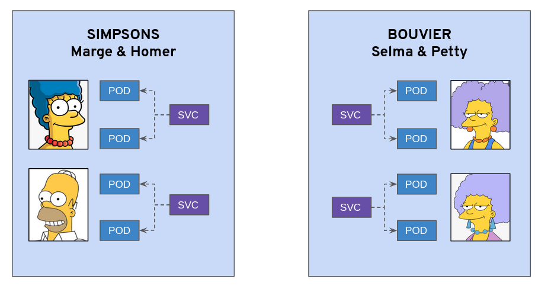
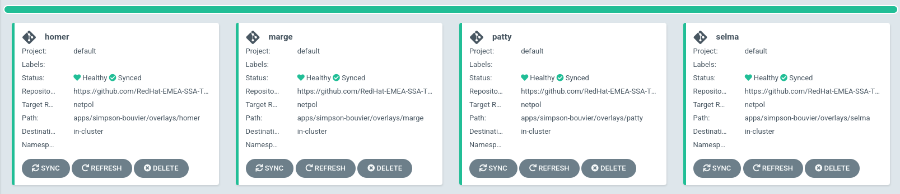
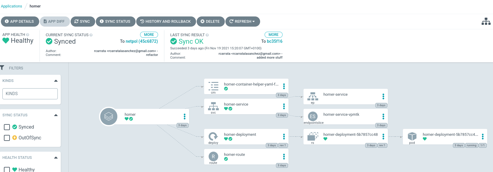
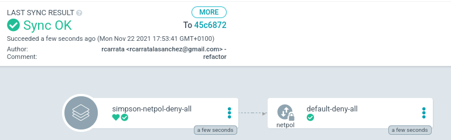
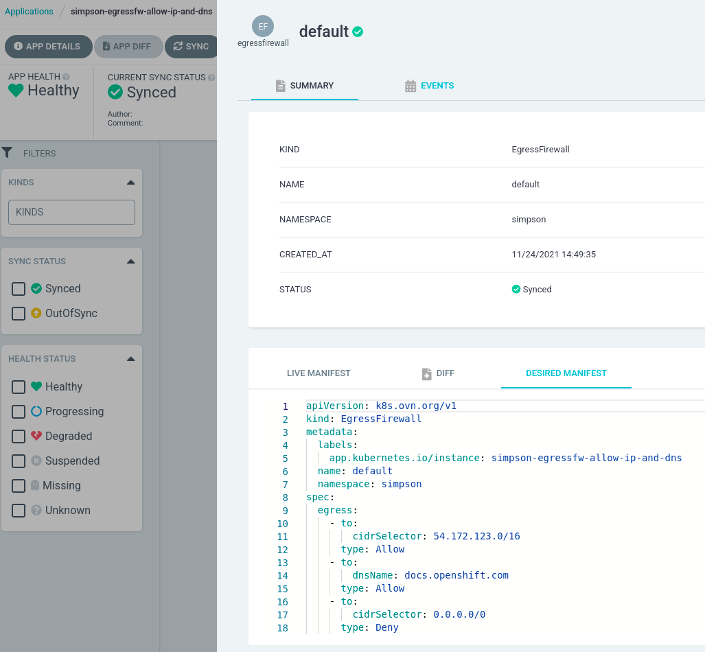
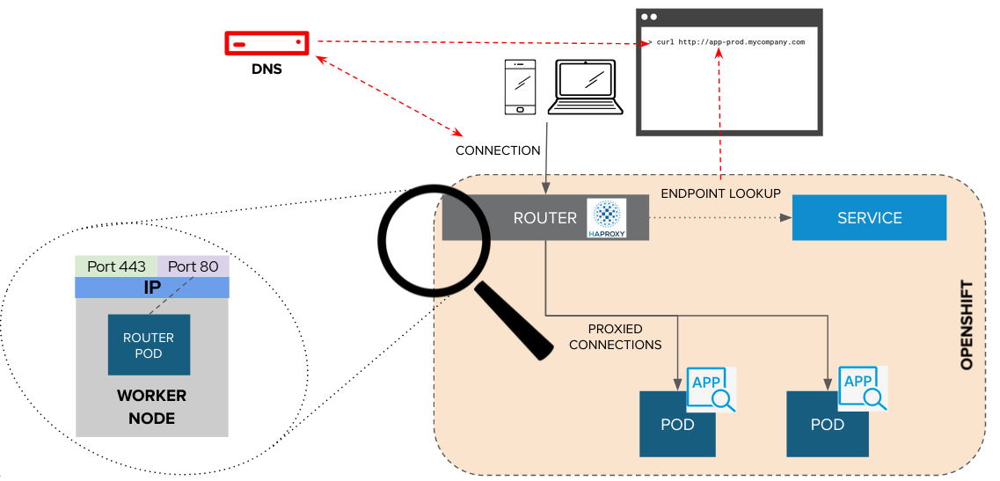
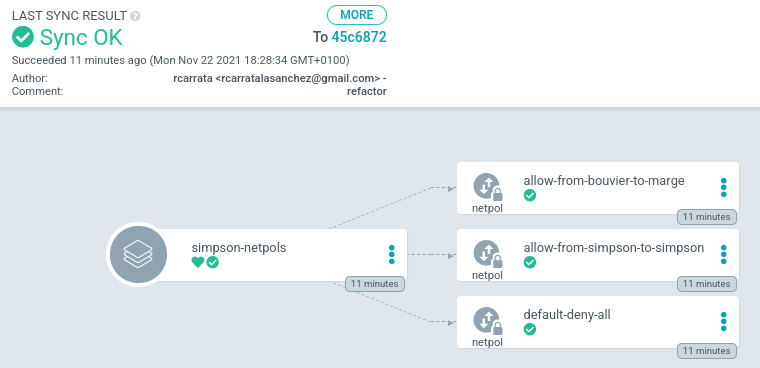
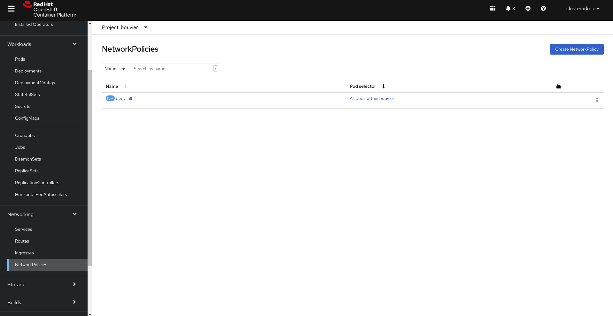

# Demo 1 - Securing your Microservices with Network Policies using GitOps

Repository for deploy GitOps examples

## 0. Network Policies Overview

If you want to control traffic flow at the IP address or port level (OSI layer 3 or 4), then you might consider using Kubernetes NetworkPolicies for particular applications in your cluster.

**NetworkPolicies** are an application-centric construct which allow you to specify how a pod is allowed to communicate with various network "entities" (we use the word "entity" here to avoid overloading the more common terms such as "endpoints" and "services", which have specific Kubernetes connotations) over the network.

* Based on labeling or annotations

* Empty label selector match all

* Rules for allowing
 * Ingress -> who can connect to this POD
 * Egress -> where can this POD connect to

* Rules
  1. traffic is allowed unless a Network Policy selecting the POD
  2. traffic is denied if pod is selected in policie but none of them have any rules allowing it
  3. = You can only write rules that allow traffic!
  4. Scope: Namespace

## 1. Demo Environment provisioning

We will be using an example microservices, where we have two main namespace "Simpson" and "Bouvier" and two microservices deployed in each namespace:



Marge and Homer microservices will be running in the Simpson namespace and Selma and Patty microservices will be running in the Bouvier namespace.

* Provision Namespace and ArgoProjects for the demo:

```
oc apply -k argo-projects/
```

NOTE: if you deployed in the early exercise this application, you can skip to the Egress Firewall step directly.


We will be using an example microservices

* Provision Namespace and ArgoProjects for the demo:

```
oc apply -k argo-projects/
```

* Login to the ArgoCD Server:

```
echo https://$(oc get route openshift-gitops-server -n openshift-gitops -o jsonpath='{.spec.host}{"\n"}')
```

* Use admin user with the password:

```
oc get secret/openshift-gitops-cluster -n openshift-gitops -o jsonpath='\''{.data.admin\.password}'\' | base64 -d
```

NOTE: you can also login using the Openshift SSO because it's enabled using Dex OIDC integration.

* Deploy the ApplicationSet containing the Applications to be secured:

```
oc apply -f argo-apps/dev-env-apps.yaml
```

* Check that the applications are deployed properly in ArgoCD:



* Check the pods are up && running:

```
oc get pods -o wide -n simpson
oc get pods -o wide -n bouvier
```

* Check that the apps are working properly:

```
oc -n bouvier exec -ti deploy/patty-deployment -- ./container-helper check
oc -n bouvier exec -ti deploy/selma-deployment -- ./container-helper check
oc -n simpson exec -ti deploy/homer-deployment -- ./container-helper check
oc -n simpson exec -ti deploy/marge-deployment -- ./container-helper check
```

* You can check each Argo Application in ArgoCD:



* As you can check all the communications are allowed between microservices:

```
marge.simpson             : 1
selma.bouvier             : 1
patty.bouvier             : 1
```

the 1, means that the traffic is OK, and the 0 are the NOK.

## 2. Network Policies Demo with GitOps

### 2.1. **Use Case 1** - Simpson Deny ALL

In the first use case, we will deny all the ingress connectivity to the Simpsons namespace, so nobody can connect to the pods of each microservice in the Simpson namespace (even no communication will be allowed among their own microservices living in the Simpson ns).

* Apply the Argo Application that will apply the Network Policy for deny all the traffic:

```
oc apply -f argo-apps/netpol-simpson-deny-all.yaml
```



```
apiVersion: networking.k8s.io/v1
kind: NetworkPolicy
metadata:
  labels:
    app.kubernetes.io/instance: simpson-netpol-deny-all
  name: default-deny-all
  namespace: simpson
spec:
  podSelector: {}
```

* Run the connectivity scripts using the run-check.sh (small script checking the connectivity from and to all the microservices in the app):

```
bash run-checks.sh
UVIER CONNECTIVITY
## PATTY
marge.simpson             : 0
homer.simpson             : 0
selma.bouvier             : 1

## SELMA
marge.simpson             : 0
homer.simpson             : 0
patty.bouvier             : 1

SIMPSONS CONNECTIVITY
## HOMER
marge.simpson             : 0
selma.bouvier             : 1
patty.bouvier             : 1

## MARGE
Using config file: /container-helper/container-helper.yaml
homer.simpson             : 0
selma.bouvier             : 1
patty.bouvier             : 1
```

All the traffic TO the simpson namespace is deny (even the same namespace). Traffic is allowed from the Simpson namespace to the Bouvier namespace.

* Delete the netpol for apply the other use case

```
kubectl patch app -n openshift-gitops simpson-netpol-deny-all  -p '{"metadata": {"finalizers": ["resources-finalizer.argocd.argoproj.io"]}}' --type merge
kubectl delete app simpson-netpol-deny-all -n openshift-gitops
```

### 2.2. **Use Case 2** - Bouvier Deny ALL

* In this case we are adding the DENY policy to the namespace Bouvier:

```
oc apply -f argo-apps/netpol-bouvier-deny-all.yaml
```

* As we can see the Bouvier netpol is denying all the ingress communications to the microservices in the Bouvier namespace:

```
apiVersion: networking.k8s.io/v1
kind: NetworkPolicy
metadata:
  labels:
    app.kubernetes.io/instance: bouvier-netpol-deny-all
  name: default-deny-all
  namespace: bouvier
spec:
  podSelector: {}
```

* Once applied the network-policies we can check the communication from and to each microservice:

```
bash run-checks.sh
BOUVIER CONNECTIVITY
## PATTY
marge.simpson             : 1
homer.simpson             : 1
selma.bouvier             : 0

## SELMA
marge.simpson             : 1
homer.simpson             : 1
patty.bouvier             : 0

SIMPSONS CONNECTIVITY
## HOMER
marge.simpson             : 1
selma.bouvier             : 0
patty.bouvier             : 0

## MARGE
homer.simpson             : 1
selma.bouvier             : 0
patty.bouvier             : 0
```

All the traffic TO the Bouvier namespace is deny (even the same namespace). Traffic is allowed from the Bouvier namespace to the Simpson namespace.

* Delete the netpol for apply the other use case

```
oc patch app -n openshift-gitops bouvier-netpol-deny-all  -p '{"metadata": {"finalizers": ["resourc
es-finalizer.argocd.argoproj.io"]}}' --type merge

oc delete app bouvier-netpol-deny-all -n openshift-gitops
```

### 2.3. **Use Case 3** - Bouvier allow internal communication

* We will allow the communication in all the microservices that are in the same namespace, so Selma and Patty will be able to communicate each other:

```
oc apply -f argo-apps/netpol-bouvier.yaml
```



* If we check the network policy applied, we can see the that there is a ingress rule with the namespaceSelector with the label "house: bouvier":

```
apiVersion: networking.k8s.io/v1
kind: NetworkPolicy
metadata:
  labels:
    app.kubernetes.io/instance: bouvier-netpol-deny-all
  name: allow-from-bouvier-to-bouvier
  namespace: bouvier
spec:
  ingress:
    - from:
        - namespaceSelector:
            matchLabels:
              house: bouvier
  podSelector: {}
  policyTypes:
    - Ingress
```

### 2.4. **Use Case 4** - Bouvier allow communication from Marge

As the Bouvier sisters trust Marge, but NOT trust Homer we will only allow the ingress communication from Marge only:



* In the step early we applied though GitOps the Network Policies from the Use Case 3 and 4 (this one). The Network Policy for the Use Case 4 is the following:

```
apiVersion: networking.k8s.io/v1
kind: NetworkPolicy
metadata:
  labels:
    app.kubernetes.io/instance: bouvier-netpols
  name: allow-from-marge-simpson
  namespace: bouvier
spec:
  ingress:
    - from:
        - namespaceSelector:
            matchLabels:
              house: simpson
          podSelector:
            matchLabels:
              app: marge
  podSelector: {}
  policyTypes:
    - Ingress
```

as you can check the Network Policies applied, allows communication to the namespace simpson with a namespace selector and specifically we allow with a podSelector the pod with the label "app: marge", that it's the marge pod.

* If we check the use cases from Use Case 3 and 4:

```
bash run-checks.sh
BOUVIER CONNECTIVITY

## PATTY
marge.simpson             : 1
homer.simpson             : 1
selma.bouvier             : 1

## SELMA
marge.simpson             : 1
homer.simpson             : 1
patty.bouvier             : 1

SIMPSONS CONNECTIVITY
## HOMER
marge.simpson             : 1
selma.bouvier             : 0
patty.bouvier             : 0

## MARGE
Using config file: /container-helper/container-helper.yaml
homer.simpson             : 1
selma.bouvier             : 1
patty.bouvier             : 1
```

as expected to the Bouvier namespace, only Marge it's allowed to communicate, and between the Bouvier sisters (same namespace) the communication is also allowed. But Homer's communication to the Bouvier namespace as it's not trusted, it's DENIED.

* Delete the netpol for apply the other use cases

```
oc patch app -n openshift-gitops bouvier-netpols  -p '{"metadata": {"finalizers": ["resources-finalizer.argocd.argoproj.io"]}}' --type merge

oc delete -n openshift-gitops application bouvier-netpols
```

### 2.5. **Use Case 5** - Allow communication from Bouvier Namespace to Simpson Namespace + Allow Simpson same namespace communication

In this case we will allow in the Simpson namespace the communication between the microservices on the same project / namespace (from/to Marge-Homer):

```
oc apply -f argo-apps/netpol-simpson.yaml
```



The network Policies are the following for the allow from Bouvier to Marge:

```
apiVersion: networking.k8s.io/v1
kind: NetworkPolicy
metadata:
  labels:
    app.kubernetes.io/instance: simpson-netpols
  name: allow-from-bouvier-to-marge
  namespace: simpson
spec:
  ingress:
    - from:
        - namespaceSelector:
            matchLabels:
              house: bouvier
  podSelector:
    matchLabels:
      app: marge
  policyTypes:
    - Ingress
```

and for allow on the same Simpson namespace:

```
apiVersion: networking.k8s.io/v1
kind: NetworkPolicy
metadata:
  labels:
    app.kubernetes.io/instance: simpson-netpols
  name: allow-from-simpson-to-simpson
  namespace: simpson
spec:
  ingress:
    - from:
        - namespaceSelector:
            matchLabels:
              house: simpson
  podSelector: {}
  policyTypes:
    - Ingress
```

The communication checks are the following:

```
BOUVIER CONNECTIVITY
## PATTY
marge.simpson             : 1
homer.simpson             : 0
selma.bouvier             : 1

## SELMA
marge.simpson             : 1
homer.simpson             : 0
patty.bouvier             : 1

SIMPSONS CONNECTIVITY
## HOMER
marge.simpson             : 1
selma.bouvier             : 1
patty.bouvier             : 1

## MARGE
homer.simpson             : 1
selma.bouvier             : 1
patty.bouvier             : 1
```

As we can see the only communication that it's not allowed is FROM the Bouvier namespace to the Homer App as expected.

### 2.7. **Use Case 6** - Bouvier Netpols + Simpson Netpols

* Now, we will add both Network Policies, the Bouvier AND the Simpson Network Policies:

```
oc apply -f argo-apps/netpol-simpson.yaml

oc apply -f argo-apps/netpol-bouvier.yaml
```

* As we can check in the ArgoCD namespace we can see that both set of Netpols are successfully applied:


* If we check the results of the connectivity tests:

```
bash run-checks.sh
BOUVIER CONNECTIVITY
## PATTY
marge.simpson             : 1
homer.simpson             : 0
selma.bouvier             : 1

## SELMA
marge.simpson             : 1
homer.simpson             : 0
patty.bouvier             : 1

SIMPSONS CONNECTIVITY
## HOMER
marge.simpson             : 1
selma.bouvier             : 0
patty.bouvier             : 0

## MARGE
homer.simpson             : 1
selma.bouvier             : 1
patty.bouvier             : 1
```

as we can check Homer is only capable to communicate with Marge because of the Network Policies won't allow him to communicate to one except in the same namespace.
Marge is able to communicate with everyone because of the Network Policies of allow, and the Bouvier Sisters are not able to communicate with Homer.

### 2.8. **Use Case 8** - Network Policies with UI

You can also use the UI to create Network Policies:

