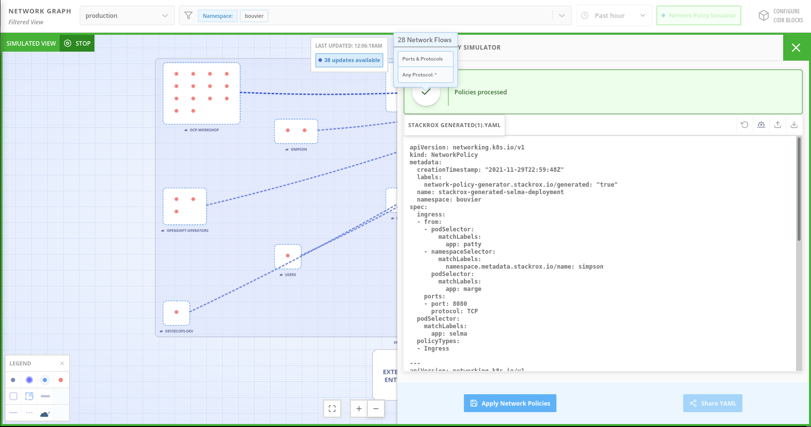
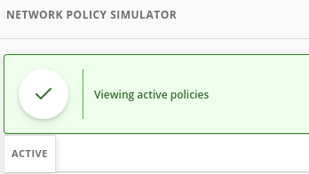

# Demo 4 - OpenShift Network Visualization and Securization with Advanced Cluster Security for Kubernetes

A Kubernetes network policy is a specification of how groups of pods are allowed to communicate with each other and other network endpoints. These network policies are configured as YAML files.

By looking at these files alone, it is often hard to identify whether the applied network policies achieve the desired network topology.

**Red Hat Advanced Cluster Security for Kubernetes** gathers all defined network policies from your orchestrator and provides functionality to make these policies easier to use.

To support network policy enforcement, Red Hat Advanced Cluster Security for Kubernetes provides:
* Network graph
* Network policy simulator
* Network policy generator


## Red Hat Advanced Cluster Security for Kubernetes

Red Hat Advanced Cluster Security for Kubernetes (Red Hat Advanced Cluster Security or ACS) provides the tools and capabilities to address the security needs of a cloud-native development approach on Kubernetes.

The ACS solution offers visibility into the security of your cluster, vulnerability management, and security compliance through auditing, network segmentation awareness and configuration, security risk profiling, security-related configuration management, threat detection, and incident response. In addition, ACS grants an ability to pull the actions from that tooling deep into the application code development process through APIs.

These security features represent the primary work any developer or administrator faces as they work across a range of environments, including multiple datacenters, private clouds, or public clouds that run Kubernetes clusters.

## Demo Environment provisioning

We will be using an example microservices, where we have two main namespace "Simpson" and "Bouvier"
and two microservices deployed in each namespace:


Marge and Homer microservices will be running in the Simpson namespace and Selma and Patty microservices will be running in the Bouvier namespace.

* Provision Namespace and ArgoProjects for the demo:

```sh
oc apply -k argo-projects/
```

NOTE: if you deployed in the early exercise this application, you can skip to the Egress Firewall step directly.

* Login to the ArgoCD Server:

```sh
echo https://$(oc get route openshift-gitops-server -n openshift-gitops -o jsonpath='{.spec.host}{"\n"}')
```

* Use admin user with the password:

```sh
oc get secret/openshift-gitops-cluster -n openshift-gitops -o jsonpath='\''{.data.admin\.password}'\'' | base64 -d
```

NOTE: you can also login using the Openshift SSO because it's enabled using Dex OIDC integration.

* Deploy the ApplicationSet containing the Applications to be secured:

```sh
oc apply -f argo-apps/dev-env-apps.yaml
```

* Check that the applications are deployed properly in ArgoCD:


* Check the pods are up && running:

```sh
oc get pods -o wide -n simpson
oc get pods -o wide -n bouvier
```

* Check that the apps are working properly:

```sh
oc -n bouvier exec -ti deploy/patty-deployment -- ./container-helper check
oc -n bouvier exec -ti deploy/selma-deployment -- ./container-helper check
oc -n simpson exec -ti deploy/homer-deployment -- ./container-helper check
oc -n simpson exec -ti deploy/selma-deployment -- ./container-helper check
```

* You can check each Argo Application in ArgoCD:


* As you can check all the communications are allowed between microservices:

```sh
marge.simpson             : 1
selma.bouvier             : 1
patty.bouvier             : 1
```

the 1, means that the traffic is OK, and the 0 are the NOK.

* Run several times the run-checks.sh script for generate some traffic between the microservices:

```sh
bash run-checks.sh

BOUVIER CONNECTIVITY
## PATTY
marge.simpson             : 1
homer.simpson             : 1
selma.bouvier             : 1

## SELMA
marge.simpson             : 1
homer.simpson             : 1
patty.bouvier             : 1

SIMPSONS CONNECTIVITY
## HOMER
marge.simpson             : 1
selma.bouvier             : 1
patty.bouvier             : 1

## MARGE
homer.simpson             : 1
selma.bouvier             : 1
patty.bouvier             : 1
```

## RHACS Network Graph

The Network Graph is a flow diagram, firewall diagram, and firewall rule builder in one.


In the upper left you’ll see the dropdown for clusters so I can easily navigate between any of the clusters that are connected to ACS.

* The default view, Active, shows me actual traffic for the Past Hour between the deployments in all of the namespaces.

You can change the time frame in the upper right dropdown, and the legend at bottom left

* Zoom in on Bouvier Namespace:


As we zoom in, the namespace boxes show the individual deployment names

* Click on **patty-deployment** pod.
* Clicking on a deployment brings up details of the types of traffic observed including source or destination and ports.


### Network Flow Baseline

Let's define a baseline of network flows in the Bouvier namespace where we trust Marge deployments, but NOT trust the Homer deployments.

For this reason we will add the Homer Deployment network flows as "Anomalous Flows":

* Select the Homer deployments as Ingress and Egress:


* Check the Anomalous Network flows, that need to be the 2 Homer deployments network flows (Ingress - Egress):


as you can check the Traffic is two-way (Ingress - Egress) from the Simpson namespace, Port 8080, TCP to the Patty Deployment.

### Alert on Baseline Violations

Now that we have defined what is our Network Baseline, where Homer deployments flows are defined as Anonymous Flow, we will define an "Alert on Baseline Violations".

An Alert on Baseline Violations, will add a Violation alert when a Anonymous Flows is detected. For doing that the "Alert on Baseline Violations" flag in the Baseline Settings needs to be enabled:


* Run several times the run-checks.sh script for generate some traffic between the microservices:

```sh
bash run-checks.sh
```

* Check the Violations tab for new Violation, and check for the Unauthorized Network Flows violation:


* Check the Unauthorized Network Flow for the Patty Deployment:


### Network Policy Simulator


The Network Policy Simulator is designed to help solve this problem by using the history of observed traffic to build firewall rules. Click on Generate and Simulate

You’ll notice, though, that the firewall rules we’re generating are not proprietary rules, but OpenShift-native Network Policy objects. This feature, more than any other, illustrates the philosophy that ACS represents: Security through platform-native features, with fixes supplied as configuration for OpenShift.

By implementing stronger security through declarative code we believe this avoids the anti-pattern of having configuration rules in a separate system - this code becomes part of your application, ensuring the consistency of “single source of truth” from your codebase.

This approach also reduces operational risk since there is no proprietary firewall in your cluster or in your pods that could fail, causing an application outage. ACS is leveraging the firewall that’s already in your OpenShift cluster.

* Click "Generate and simulate network policies" in the Bouvier Namespace, and we will receive the Network Policy generated for the Bouvier Namespace based in the network policy network flows:


* We want to adjust the Network Policy autogenerated, so we will click on Download, and we will open the file in an editor text.

* Homer deployments are not allowed by default so we will delete the part into the Network Policy:

```
    - namespaceSelector:
        matchLabels:
          namespace.metadata.stackrox.io/name: simpson
      podSelector:
        matchLabels:
          app: homer
```

* Import the yaml generated and modified, and Click the Upload a network policy YAML:





* In the Network Graph, in the Bouvier namespace, click the Active Flows, and in the Selma Deployment click the Network Policies tab to see the network policies generated automatically by RHACS.

```sh
BOUVIER CONNECTIVITY
## PATTY
marge.simpson             : 1
homer.simpson             : 1
selma.bouvier             : 1

## SELMA
marge.simpson             : 1
homer.simpson             : 1
patty.bouvier             : 1

SIMPSONS CONNECTIVITY
## HOMER
marge.simpson             : 1
selma.bouvier             : 0
patty.bouvier             : 0

## MARGE
homer.simpson             : 1
selma.bouvier             : 1
patty.bouvier             : 1

```

if you check the Homer Connectivity, you can check that the connectivity from the Homer deployment to the Selma.Bouvier and Patty.Bouvier is NOT allowed, for this the ouput is zero.
