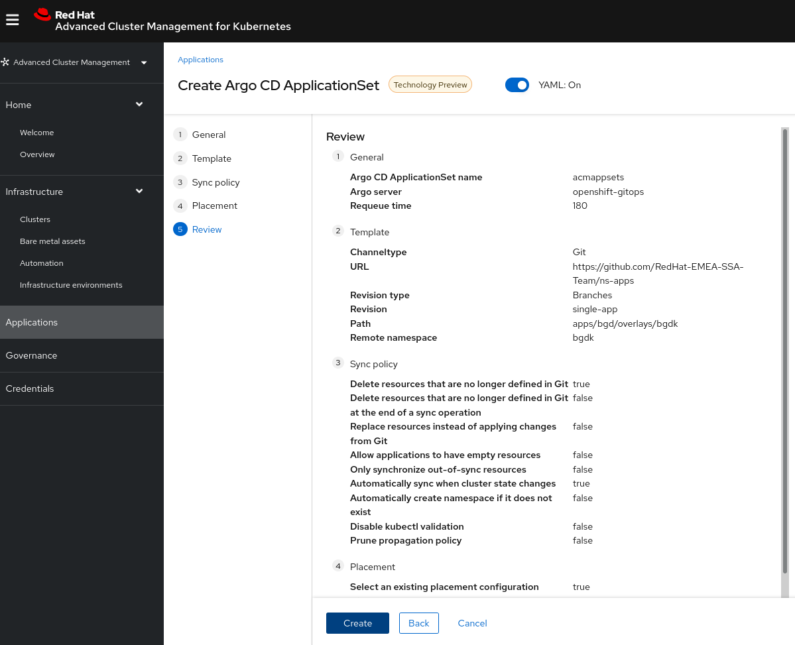
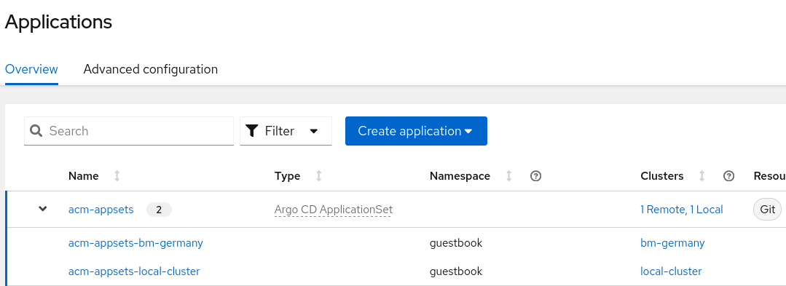
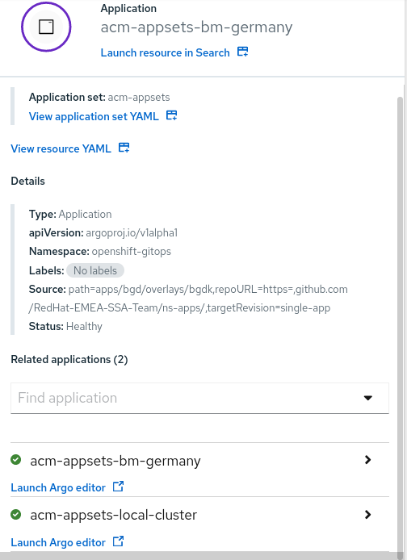
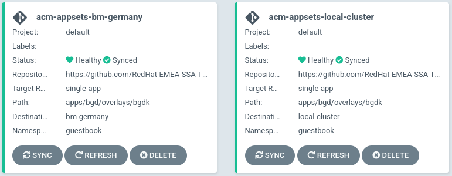
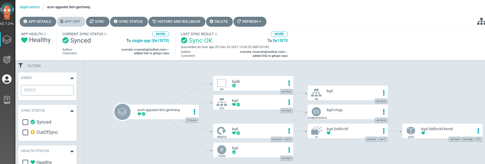
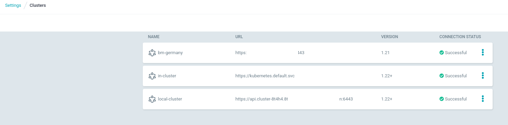

# Demo 9 - ACM GitOps with OpenShift GitOps

* https://github.com/open-cluster-management/rhacm-docs/blob/2.4_stage/applications/gitops_config.adoc

```
apiVersion: cluster.open-cluster-management.io/v1alpha1
kind: ManagedClusterSet
metadata:
  name: all-openshift-clusters
  spec: {}
```

* Add the imported clusters into the ClusterSet:

[Add Imported clusterset with Console](https://github.com/open-cluster-management/rhacm-docs/blob/2.4_stage/clusters/managedclustersets.adoc#creating-a-managedclustersetbinding-by-using-the-console)

[Add Imported clusterset with CLI](https://github.com/open-cluster-management/rhacm-docs/blob/2.4_stage/clusters/managedclustersets.adoc#adding-clusters-to-a-managedclusterset-by-using-the-command-line)

* Add the ManagedClusterSetBinding:

```
apiVersion: cluster.open-cluster-management.io/v1alpha1
kind: ManagedClusterSetBinding
metadata:
  name: all-openshift-clusters
  namespace: openshift-gitops
spec:
  clusterSet: all-openshift-clusters
```

```
oc apply -f managedclustersetbinding.yaml
```

```
apiVersion: cluster.open-cluster-management.io/v1alpha1
kind: Placement
metadata:
  name: all-openshift-clusters
  namespace: openshift-gitops
spec:
  predicates:
  - requiredClusterSelector:
      labelSelector:
        matchExpressions:
        - key: vendor
          operator: "In"
          values:
          - OpenShift
```

```
apiVersion: apps.open-cluster-management.io/v1alpha1
kind: GitOpsCluster
metadata:
  name: argo-acm-clusters
  namespace: openshift-gitops
spec:
  argoServer:
    cluster: local-cluster
    argoNamespace: openshift-gitops
  placementRef:
    kind: Placement
    apiVersion: cluster.open-cluster-management.io/v1alpha1
    name: all-openshift-clusters
    namespace: openshift-gitops
```

* With the UI generate a ApplicationSet with for an applicationset of example:



```
apiVersion: argoproj.io/v1alpha1
kind: ApplicationSet
metadata:
  creationTimestamp: '2021-12-03T11:41:52Z'
  generation: 6
  name: acm-appsets
  namespace: openshift-gitops
  resourceVersion: '3001480'
  uid: c500bc32-eec8-4775-bec4-68e420788a60
spec:
  generators:
    - clusterDecisionResource:
        configMapRef: acm-placement
        labelSelector:
          matchLabels:
            cluster.open-cluster-management.io/placement: acm-appsets-placement
        requeueAfterSeconds: 180
  template:
    metadata:
      name: 'acm-appsets-{{name}}'
    spec:
      destination:
        namespace: bgdk
        server: '{{server}}'
      project: default
      source:
        path: apps/bgd/overlays/bgdk
        repoURL: 'https://github.com/RedHat-EMEA-SSA-Team/ns-apps/'
        targetRevision: single-app
      syncPolicy:
        automated:
          prune: true
          selfHeal: true
```

NOTE: the destination namespace could be openshift-gitops. BGDK could be change, but it leaves in that way because we need to put a destination namespace, even it's not necessary for the applicationset itself (not needed also for the application bgdk

The result is an ApplicationSet that is generated:



The application have the ApplicationSet generated for EACH cluster that matches the Placement defined as acm-appsets-placement, during the definition of the ApplicationSet before. Could also match labels of the clusters, to not depend only of Placement object.


In the application generated, each of the Application will have their own Application, Placement and Cluster.


These are the details of the Application generated by the ApplicationSet:



In the OpenShift GitOps argo-controller, two applications are generated by the ApplicationSet generated by ACM, and each Argo Application is generated for each cluster managed in the ClusterSet that matches with the Placement:



* Each Argo ApplicationSet manages the Application in each cluster managed, like for example the deployment of BGDK application in BM-Germany cluster.



* In the Settings of ArgoCD/OpenShift GitOps, in the Clusters, there are the clusters Managed by ACM with the ClusterSet.


