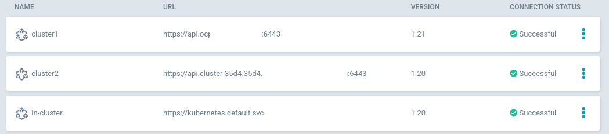
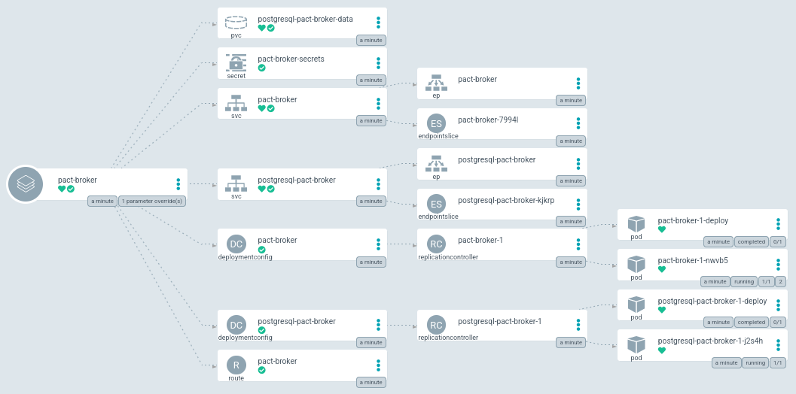
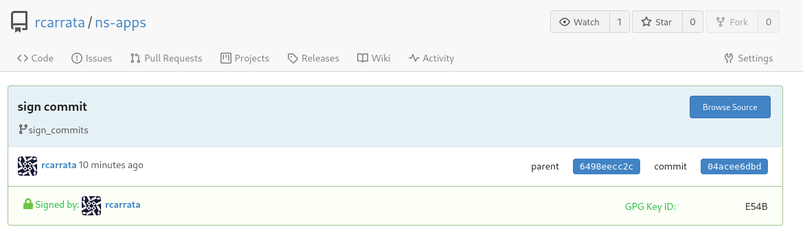

# Secure GitOps supply chain with GnuPG signature verification in ArgoCD

As of v1.7 it is possible to configure ArgoCD to only sync against commits that are signed in Git using GnuPG. Signature verification is configured on project level.

If a project is configured to enforce signature verification, all applications associated with this project must have the commits in the source repositories signed with a GnuPG public key known to ArgoCD.

ArgoCD will refuse to sync to any revision that does not have a valid signature made by one of the configured keys. The controller will emit a ResourceComparison error if it tries to sync to a revision that is either not signed, or is signed by an unknown or not allowed public key.

By default, signature verification is enabled but not enforced.

Verification of GnuPG signatures is only supported with Git repositories. It is not possible using Helm repositories.

## Deploy Gitea Environment

* Get the Helm Chart of Gitea:

```sh
git clone https://github.com/rcarrata/rcarrata-charts.git
cd charts/
```

* Deploy the Helm Chart of Gitea in your cluster

```sh
helm upgrade --install gitea --create-namespace -n gitea gitea/ --set db.password=redhat --set hostname=gitea.xxx.xxxx.xxx.com
```

* Check that the Helm Chart of Gitea have been deployed properly:

```
kubectl get pod -n gitea
NAME                READY   STATUS      RESTARTS   AGE
gitea-1-deploy      0/1     Completed   0          3m48s
gitea-1-zrpcz       1/1     Running     0          3m48s
gitea-db-1-deploy   0/1     Completed   0          3m49s
gitea-db-1-h8w65    1/1     Running     0          3m48s
```

NOTE: Due to https://github.com/go-gitea/gitea/issues/5376 issue is not possible to generate first user by api

## Configure the users and tokens in Gitea

* Generate a gitea-admin with admin privileges:

```sh
export gturl=https://$(kubectl get route -n gitea gitea -o jsonpath='{.spec.host}')

kubectl -n gitea exec -ti $(kubectl get pod -n gitea -l deploymentconfig=gitea --no-headers=true | awk '{ print $1 }') -- giteacmd admin user create --username gitea-admin --password redhat --email jim@redhat.com --admin
```

* Generate the token for the new gitea-admin created:

```sh
export GTUID=$(curl -s -X GET ${gturl}/api/v1/users/${gtuser} -H "accept: application/json" -H
"Authorization: token ${TOKEN}"  | jq -r .id)
```

* Generate and Get token:

```sh
TOKEN=$(curl -s -X POST https://${gturl}/api/v1/users/${gtadmin}/tokens -u ${gtadmin}:${gtpass} -H "Content-Type: application/json" -d '{"name": "admintoken"}' -v | jq -r .sha1)
```

* Get User ID:

```sh
export GTUID=$(curl -s -X GET ${gturl}/api/v1/users/${gtuser} -H "accept: application/json" -H "Authorization: token ${TOKEN}"  | jq -r .id)
```

* Migrate repos:

```sh
for repo in https://github.com/RedHat-EMEA-SSA-Team/ns-gitops https://github.com/RedHat-EMEA-SSA-Team/ns-apps
do
	reponame=$(basename ${repo})
	echo "Migrating Repo - ${reponame}"
	echo "============================"
	curl -s -X POST ${gturl}/api/v1/repos/migrate \
	-H "accept: application/json" \
	-H "Authorization: token ${TOKEN}" \
	-H "Content-Type: application/json" -d \
	"{\"clone_addr\":\"${repo}\",\"description\":\"\",\"issues\":false,\"milestones\":false,\"mirror\":false,\"private\":false,\"repo_name\":\"${reponame}\",\"uid\":${GTUID}}"
done
```

* Create developer token:

```sh
export DTOKEN=$(curl -s -X POST ${gturl}/api/v1/users/${gtuser}/tokens -u ${gtuser}:${gtpass} -H "Content-Type: application/json" -d '{"name": "develtoken"}' | jq -r .sha1)
```

## Configure the GPG Keys and link them within Gitea

* [Generate the GPG keys](https://docs.github.com/en/authentication/managing-commit-signature-verification/generating-a-new-gpg-key) in your laptop.

* Extract the ID of your gpg key generated and associated with your uid:

```sh
KEY_ID=$(gpg --list-secret-keys --keyid-format=long | grep sec | cut -f2 -d '/' | awk '{ print $1}')
```

* Export your GPG Keys:

```
gpg --armor --export $KEY_ID | xclip
```

NOTE: if you have not installed xclip you can copy & paste the gpg public key.

* Go to the gitea website deployed in your OCP/K8s cluster:

```sh
echo $gturl

https://gitea.xxx.xxxx.xxx.com
```

* Login with the user / password generated in the step before (gtuser and gtpass):

* Go to the Settings -> SSH/GPG Keys and Add New GPG Keys:



## Signing the Commits in our Repo

* Download the repository forked to the Gitea Server to introduce a change:

```
git clone https://gitea.xxx.xxx.xxx.com/rcarrata/ns-apps.git
git checkout sign_commits
```

* We need to tell git about the gpg key. Let's set the GPG Key for Git with:

```sh
git config --global user.signingkey $KEY_ID
```

NOTE: For more information about this check [Telling Git about your GPG key
documentation](https://docs.github.com/en/authentication/managing-commit-signature-verification/telling-git-about-your-signing-key#telling-git-about-your-gpg-key-2)

* Introduce a change in the repo, and add this file into the commit:

```sh
echo "Testing Sign Commit" >> README.md

git add .
```

* Add a commit signed with your gpg key:

```
git commit -S -am "sign commit"
[sign_commits 04acee6] sign commit
 1 file changed, 1 insertion(+)
```

NOTE: With the flag -S the git commit command will be signed with the GPG key designed in the previous step.

* Push the changes to the Gitea Server:

```sh
git push
```

NOTE: the credentials will be asked, use the gtuser and gtpass credentials used to generate the user.

* Check in the Gitea server that the commit is properly sign with the GPG key imported in the early steps:



* Click on the specific commit signed for get more details:



## Deploy ArgoCD / OpenShift GitOps:

* We need to install OpenShift GitOps in the ACM Hub with the Operator. You can follow the [official documentation for OpenShift GitOps](https://docs.openshift.com/container-platform/4.9/cicd/gitops/installing-openshift-gitops.html).

* On the other hand if you want to deploy the ArgoCD upstream, follow [Install ArgoCD upstream documentation](https://argo-cd.readthedocs.io/en/stable/getting_started/#1-install-argo-cd).

* Check that everything is ok with the OpenShift GitOps deployment:

```
kubectl get pod -n openshift-gitops
NAME                                                          READY   STATUS    RESTARTS   AGE
cluster-54b7b77995-85275                                      1/1     Running   0          41h
kam-76f5ff8585-gz6s4                                          1/1     Running   0          41h
openshift-gitops-application-controller-0                     1/1     Running   0          41h
openshift-gitops-applicationset-controller-6948bcf87c-hbwdh   1/1     Running   0          41h
openshift-gitops-dex-server-6b499dbfb6-cvkmx                  1/1     Running   0          41h
openshift-gitops-redis-7867d74fb4-5r9nj                       1/1     Running   0          41h
openshift-gitops-repo-server-6dc777c845-dxxhf                 1/1     Running   0          41h
openshift-gitops-server-785b47d889-phrhp                      1/1     Running   0          41h
```

## GnuPG signature verification

As we described before, it is possible to configure ArgoCD to only sync against commits that are signed in Git using GnuPG. Signature verification is configured on project level.

If a project is configured to enforce signature verification, all applications associated with this project must have the commits in the source repositories signed with a GnuPG public key known to ArgoCD. ArgoCD will refuse to sync to any revision that does not have a valid signature made by one of the configured keys.


## Links of Interest

* [ArgoCD GnuPG Verification](https://argo-cd.readthedocs.io/en/stable/user-guide/gpg-verification/)
