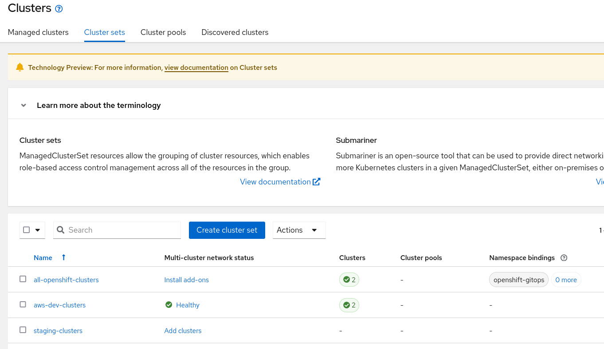
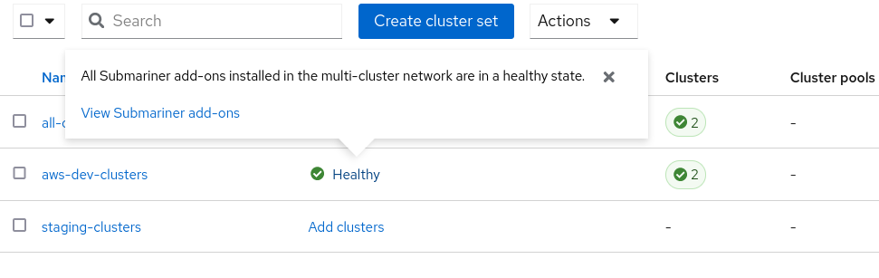
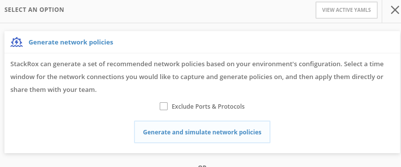
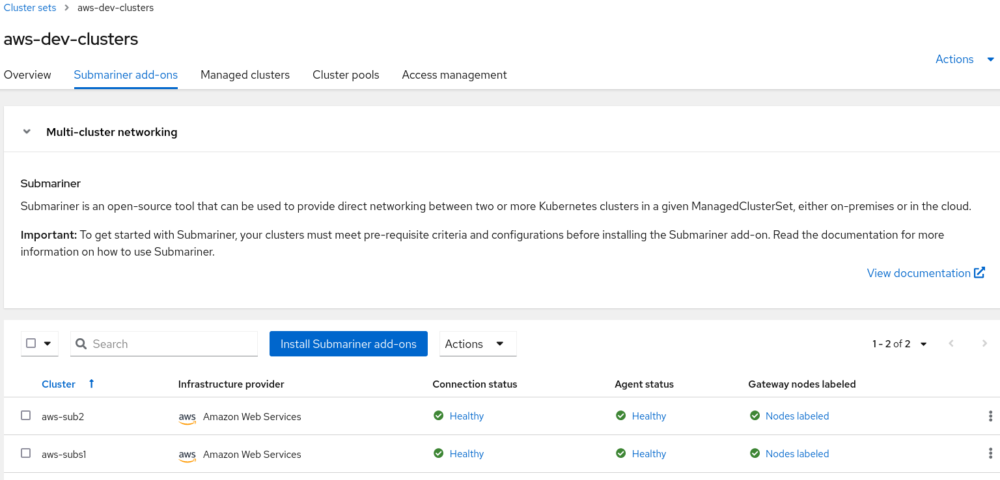
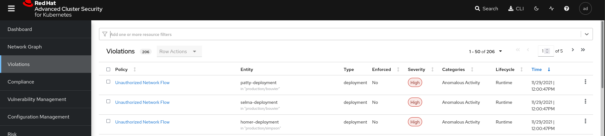
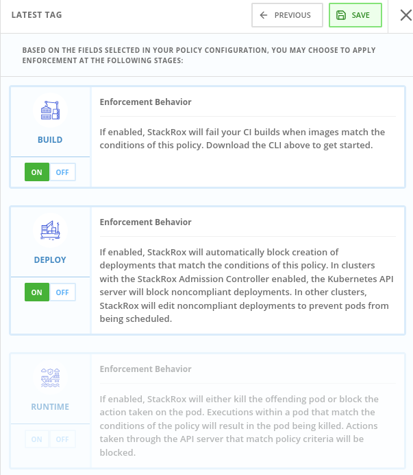
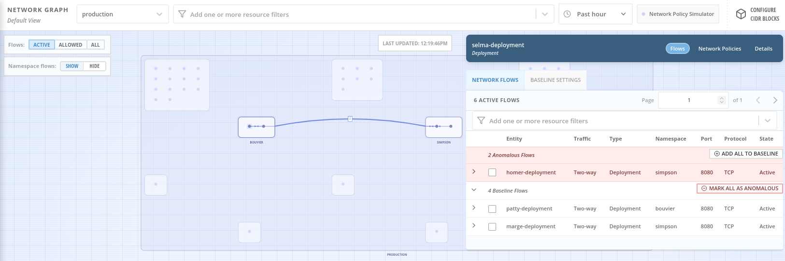

# Demo 7 - Securing communication between OpenShift Clusters with Submariner in Advanced Cluster Management for Kubernetes


## Demo Environment provisioning

We will be using an example microservices, where we have two main namespace "Simpson" and "Bouvier"
and two microservices deployed in each namespace:


Marge and Homer microservices will be running in the Simpson namespace and Selma and Patty microservices will be running in the Bouvier namespace.

* Provision Namespace and ArgoProjects for the demo:

```sh
oc apply -k argo-projects/
```

NOTE: if you deployed in the early exercise this application, you can skip to the Egress Firewall step directly.

* Login to the ArgoCD Server:

```sh
echo https://$(oc get route openshift-gitops-server -n openshift-gitops -o jsonpath='{.spec.host}{"\n"}')
```

* Use admin user with the password:

```sh
oc get secret/openshift-gitops-cluster -n openshift-gitops -o jsonpath='\''{.data.admin\.password}'\'' | base64 -d
```

NOTE: you can also login using the Openshift SSO because it's enabled using Dex OIDC integration.

* Deploy the ApplicationSet containing the Applications to be secured:

```sh
oc apply -f argo-apps/dev-env-apps.yaml
```

* Check that the applications are deployed properly in ArgoCD:


* Check the pods are up && running:

```sh
oc get pods -o wide -n simpson
oc get pods -o wide -n bouvier
```

* Check that the apps are working properly:

```sh
oc -n bouvier exec -ti deploy/patty-deployment -- ./container-helper check
oc -n bouvier exec -ti deploy/selma-deployment -- ./container-helper check
oc -n simpson exec -ti deploy/homer-deployment -- ./container-helper check
oc -n simpson exec -ti deploy/selma-deployment -- ./container-helper check
```

* You can check each Argo Application in ArgoCD:


* As you can check all the communications are allowed between microservices:

```sh
marge.simpson             : 1
selma.bouvier             : 1
patty.bouvier             : 1
```

the 1, means that the traffic is OK, and the 0 are the NOK.

# Securing communication between OpenShift Clusters with Submariner in Advanced Cluster Management for Kubernetes

### Install ACM thought GitOps

* [ACM Lab Deploy](https://github.com/ocp-tigers/acm-lab-deploy/blob/master/assets/stepbystep.md)

### Create AWS Clusters

* [Add AWS Credentials into ACM Hub](https://github.com/open-cluster-management/rhacm-docs/blob/2.4_stage/credentials/credential_aws.adoc)

```sh
oc get managedclusters
NAME            HUB ACCEPTED   MANAGED CLUSTER URLS                                        JOINED   AVAILABLE   AGE
local-cluster   true           https://api.cluster-8t4h4.xxx.sandbox6.opentlc.com:6443   True     True        51m
```

* [https://github.com/open-cluster-management/rhacm-docs/blob/2.4_stage/clusters/create_ocp_aws.adoc#creating-your-cluster-with-the-console](Create AWS Console)

* aws-subs1:


* aws-subs2:


```sh
oc get managedclusters -l environment=submariner
NAME        HUB ACCEPTED   MANAGED CLUSTER URLS                                    JOINED   AVAILABLE   AGE
aws-sub2    true           https://api.aws-sub2.8t4h4.sandbox6.opentlc.com:6443    True     True        6h42m
aws-subs1   true           https://api.aws-subs1.8t4h4.sandbox6.opentlc.com:6443   True     True        7h6m
```

* Generate a ManagedClusterSet.

* In the ClustersSets tab appears the clustersets:











* In the tab of the ManagedClusterSet, go to Submariner Addons and Click Install Submariner add-ons. Then select the clusters managed that you will install submariner:



* Then introduce the Access Key, Secret Access Key of each cluster managed for enable the autoinstall of the prerequisites.




* With CLI:

```sh
rm -rf /var/tmp/acm-lab-kubeconfig
touch /var/tmp/acm-lab-kubeconfig
export KUBECONFIG=/var/tmp/acm-lab-kubeconfig
export CLUSTER1=aws-subs1
export CLUSTER2=aws-sub2
```

```sh
oc login -u ocp-admin -p xxxx --insecure-skip-tls-verify --server=https://api.cluster-xxxx.xxxx.example.rcarrata.com:644
oc config rename-context $(oc config current-context) hub
```

```sh
oc login -u kubeconfig -p xxxx --insecure-skip-tls-verify --server=https://api.cluster-xxxx.xxxx.example.rcarrata.com:644
oc config rename-context $(oc config current-context) cluster1
```

```sh
oc login -u kubeconfig -p xxxx --insecure-skip-tls-verify --server=https://api.cluster-xxxx.xxxx.example.rcarrata.com:644
oc config rename-context $(oc config current-context) cluster2
```

```sh
oc config use-context hub
oc get ns | grep creds
```

```sh
SECRET_NAME_1=$(oc get secret aws-subs1-aws-creds -n $CLUSTER1 -o jsonpath='{.metadata.name}')
echo $SECRET_NAME_1

SECRET_NAME_2=$(oc get secret aws-sub2-aws-creds -n $CLUSTER2 -o jsonpath='{.metadata.name}')
echo $SECRET_NAME_2
```

```sh
cat << EOF | oc apply -f -
apiVersion: submarineraddon.open-cluster-management.io/v1alpha1
kind: SubmarinerConfig
metadata:
  name: subconfig
  namespace: $CLUSTER1
spec:
  credentialsSecret:
     name: $SECRET_NAME_1
EOF
```

```sh
oc get SubmarinerConfig -n $CLUSTER1
NAME        AGE
subconfig   2m19s
```

```sh
cat << EOF | oc apply -f -
apiVersion: submarineraddon.open-cluster-management.io/v1alpha1
kind: SubmarinerConfig
metadata:
  name: subconfig
  namespace: $CLUSTER2
spec:
  credentialsSecret:
     name: $SECRET_NAME_2
EOF
```

```sh
oc get SubmarinerConfig -n $CLUSTER2
NAME        AGE
subconfig   16s
```

TODO: review the autogenerated submariner config

```
oc get submarinerconfig -n aws-sub2 submariner -o yaml
apiVersion: submarineraddon.open-cluster-management.io/v1alpha1
kind: SubmarinerConfig
metadata:
  creationTimestamp: "2021-12-01T18:52:34Z"
  finalizers:
  - submarineraddon.open-cluster-management.io/config-cleanup
  generation: 2
  name: submariner
  namespace: aws-sub2
  resourceVersion: "1349155"
  uid: 074f957d-d135-4476-a1d9-379fd4fb1fd9
spec:
  IPSecIKEPort: 500
  IPSecNATTPort: 4500
  NATTDiscoveryPort: 4900
  NATTEnable: true
  cableDriver: libreswan
  credentialsSecret:
    name: aws-sub2-aws-creds
  gatewayConfig:
    aws:
      instanceType: c5d.large
    gateways: 1
  imagePullSpecs: {}
  subscriptionConfig:
    source: redhat-operators
    sourceNamespace: openshift-marketplace
```

```sh
oc get pod -n open-cluster-management -l app=submariner-addon
NAME                               READY   STATUS    RESTARTS   AGE
submariner-addon-c6bd856cf-7mmf2   1/1     Running   32         25h
```

```sh
POD_SUBMARINER=$(oc get pod -n open-cluster-management -l app=submariner-addon --no-headers=true | awk '{ print $1 }')
echo $POD_SUBMARINER
submariner-addon-c6bd856cf-7mmf2
```

```sh
oc logs --tail=200 $POD_SUBMARINER  -n open-cluster-management | grep Submariner
I1201 15:47:04.168503       1 event.go:282] Event(v1.ObjectReference{Kind:"Deployment", Namespace:"open-cluster-management", Name:"submariner-addon", UID:"8244a969-b1d9-4520-b797-7d4cc56194e5", APIVersion:"apps/v1", ResourceVersion:"", FieldPath:""}): type: 'Warning' reason: 'FastControllerResync' Controller "SubmarinerBrokerCRDsController" resync interval is set to 0s which might lead to client request throttling
I1201 15:47:04.168567       1 event.go:282] Event(v1.ObjectReference{Kind:"Deployment", Namespace:"open-cluster-management", Name:"submariner-addon", UID:"8244a969-b1d9-4520-b797-7d4cc56194e5", APIVersion:"apps/v1", ResourceVersion:"", FieldPath:""}): type: 'Warning' reason: 'FastControllerResync' Controller "SubmarinerBrokerController" resync interval is set to 0s which might lead to client request throttling
I1201 15:47:04.168925       1 event.go:282] Event(v1.ObjectReference{Kind:"Deployment", Namespace:"open-cluster-management", Name:"submariner-addon", UID:"8244a969-b1d9-4520-b797-7d4cc56194e5", APIVersion:"apps/v1", ResourceVersion:"", FieldPath:""}): type: 'Warning' reason: 'FastControllerResync' Controller "SubmarinerAgentController" resync interval is set to 0s which might lead to client request throttling
I1201 15:47:04.170747       1 base_controller.go:66] Waiting for caches to sync for SubmarinerBrokerController
I1201 15:47:04.170773       1 base_controller.go:66] Waiting for caches to sync for SubmarinerAgentController
I1201 15:47:04.170807       1 base_controller.go:66] Waiting for caches to sync for SubmarinerBrokerCRDsController
I1201 15:47:04.371809       1 base_controller.go:72] Caches are synced for SubmarinerBrokerController
I1201 15:47:04.371842       1 base_controller.go:109] Starting #1 worker of SubmarinerBrokerController controller ...
I1201 15:47:04.771785       1 base_controller.go:72] Caches are synced for SubmarinerAgentController
I1201 15:47:04.771830       1 base_controller.go:109] Starting #1 worker of SubmarinerAgentController controller ...
I1201 15:47:04.871121       1 base_controller.go:72] Caches are synced for SubmarinerBrokerCRDsController
I1201 15:47:04.871179       1 base_controller.go:109] Starting #1 worker of SubmarinerBrokerCRDsController controller ...
```

* [Add ClusterSet into ACM Hub](https://github.com/open-cluster-management/rhacm-docs/blob/2.4_stage/clusters/managedclustersets.adoc#creating-a-managedclusterset-by-using-the-command-line)

```sh
apiVersion: cluster.open-cluster-management.io/v1alpha1
kind: ManagedClusterSet
metadata:
  name: aws-dev-clusters
```

* [Deploy Submariner with the ManagedClusterAddOn API](https://github.com/open-cluster-management/rhacm-docs/blob/2.4_stage/services/deploy_submariner_api.adoc#deploy-submariner-with-the-managedclusteraddon-api)

```sh
oc label managedclusters aws-subs1 "cluster.open-cluster-management.io/submariner-agent=true" --overwrite
```

```sh
oc label managedclusters aws-sub2 "cluster.open-cluster-management.io/submariner-agent=true" --overwrite
```

```
oc label managedclusters <managed-cluster-name> "cluster.open-cluster-management.io/clusterset=<managed-cluster-set-name>" --overwrite
```


```sh
oc label managedclusters aws-subs1 "cluster.open-cluster-management.io/clusterset=submariner" --overwrite
```

```sh
cat << EOF | oc apply -f -
apiVersion: addon.open-cluster-management.io/v1alpha1
kind: ManagedClusterAddOn
metadata:
     name: submariner
     namespace: <managed-cluster-name>
spec:
     installNamespace: submariner-operator
```

```
...
I1201 19:00:53.959287       1 event.go:282] Event(v1.ObjectReference{Kind:"Deployment", Namespace:"open-cluster-management", Name:"submariner-addon", UID:"8244a969-b1d9-4520-b797-7d4cc56194e5", APIVersion:"apps/v1", ResourceVersion:"", FieldPath:""}): type: 'Normal' reason: 'SubmarinerClusterEnvBuild' Opened port 4800 protocol udp for intra-cluster communications
I1201 19:00:53.959326       1 event.go:282] Event(v1.ObjectReference{Kind:"Deployment", Namespace:"open-cluster-management", Name:"submariner-addon", UID:"8244a969-b1d9-4520-b797-7d4cc56194e5", APIVersion:"apps/v1", ResourceVersion:"", FieldPath:""}): type: 'Normal' reason: 'SubmarinerClusterEnvBuild' Opening port 8080 protocol tcp for intra-cluster communications
I1201 19:00:54.920367       1 event.go:282] Event(v1.ObjectReference{Kind:"Deployment", Namespace:"open-cluster-management", Name:"submariner-addon", UID:"8244a969-b1d9-4520-b797-7d4cc56194e5", APIVersion:"apps/v1", ResourceVersion:"", FieldPath:""}): type: 'Normal' reason: 'SubmarinerClusterEnvBuild' Opened port 8080 protocol tcp for intra-cluster communications
I1201 19:00:54.920411       1 event.go:282] Event(v1.ObjectReference{Kind:"Deployment", Namespace:"open-cluster-management", Name:"submariner-addon", UID:"8244a969-b1d9-4520-b797-7d4cc56194e5", APIVersion:"apps/v1", ResourceVersion:"", FieldPath:""}): type: 'Normal' reason: 'SubmarinerClusterEnvBuild' the submariner cluster env is build on aws
```

```sh
oc config use-context cluster1

oc get machineset -A | grep submariner
openshift-machine-api   aws-subs1-7zw2s-submariner-gw-eu-central-1a   1         1                             4m56s
```

```sh
oc config use-context cluster1

oc get machineset -A | grep subm
openshift-machine-api   aws-sub2-5hqb6-submariner-gw-us-east-1b   1         1         1       1           11m
```

```sh
oc get pod -A | grep subm
submariner-operator                                submariner-addon-86cc554677-c6xn2                                 1/1     Running     0               12m
submariner-operator                                submariner-gateway-mvn4m                                          1/1     Running     1 (8m43s ago)   9m26s
submariner-operator                                submariner-lighthouse-agent-548fcff6ff-jtnrl                      1/1     Running     0               11m
submariner-operator                                submariner-lighthouse-coredns-b5bcbf485-b6mnb                     1/1     Running     0               11m
submariner-operator                                submariner-lighthouse-coredns-b5bcbf485-ldqt8                     1/1     Running     0               11m
submariner-operator                                submariner-operator-847669978d-sp6b6                              1/1     Running     1 (11m ago)     12m
submariner-operator                                submariner-routeagent-69b8c                                       1/1     Running     0               11m
submariner-operator                                submariner-routeagent-7bwmf                                       1/1     Running     0               11m
submariner-operator                                submariner-routeagent-9dkxk                                       1/1     Running     0               11m
submariner-operator                                submariner-routeagent-hth7q                                       1/1     Running     0               11m
submariner-operator                                submariner-routeagent-ppvwx                                       1/1     Running     1 (8m43s ago)   9m27s
submariner-operator                                submariner-routeagent-q8tt4                                       1/1     Running     0               11m
```

### Deploy application for example

```sh
oc config use cluster1
oc -n default create deployment nginx --image=nginxinc/nginx-unprivileged:stable-alpine

oc -n default expose service nginx --port=8080

oc get serviceexport nginx -o jsonpath='{.status}' | jq -r .
{
  "conditions": [
    {
      "lastTransitionTime": "2021-12-01T19:26:48Z",
      "message": "Awaiting sync of the ServiceImport to the broker",
      "reason": "AwaitingSync",
      "status": "False",
      "type": "Valid"
    },
    {
      "lastTransitionTime": "2021-12-01T19:26:48Z",
      "message": "Service was successfully synced to the broker",
      "reason": "",
      "status": "True",
      "type": "Valid"
    }
  ]
}
```

```sh
oc -n default run submariner-test --rm -ti --image quay.io/submariner/nettest -- /bin/bash

bash-5.0# curl aws-subs1.nginx.default.svc.clusterset.local:8080 -I
HTTP/1.1 200 OK
Server: nginx/1.20.2
Date: Wed, 01 Dec 2021 19:28:41 GMT
Content-Type: text/html
Content-Length: 612
Last-Modified: Tue, 16 Nov 2021 15:04:23 GMT
Connection: keep-alive
ETag: "6193c877-264"
Accept-Ranges: bytes

bash-5.0# curl -w "dns_resolution: %{time_namelookup}, tcp_established: %{time_connect}, TTFB: %{time_starttransfer}\n" aws-subs1.nginx.default.svc.clusterset.local:8080 -o /dev/null -s

dns_resolution: 0.001939, tcp_established: 0.093243, TTFB: 0.183298
```

```sh
oc logs -n default -f --tail=2 deploy/nginx
10.132.2.40 - - [01/Dec/2021:19:28:41 +0000] "HEAD / HTTP/1.1" 200 0 "-" "curl/7.69.1" "-"
10.132.2.40 - - [01/Dec/2021:19:29:51 +0000] "GET / HTTP/1.1" 200 612 "-" "curl/7.69.1" "-"
```
