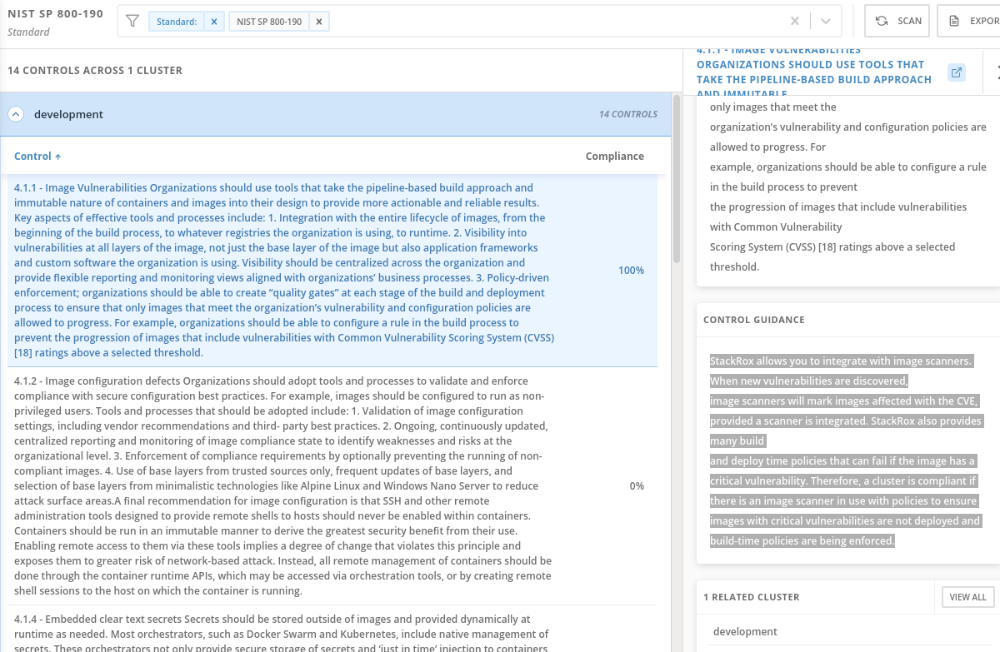

# Demo 2 - Securing your Egress Traffic within your workloads with Egress Firewall using GitOps

## Egress Firewall Overview - OVN Kubernetes Plugin

We can use an egress firewall to limit the external hosts that some or all pods can access from within the cluster. An egress firewall supports the following scenarios:

* A pod can only connect to internal hosts and cannot initiate connections to the public internet.
* A pod can only connect to the public internet and cannot initiate connections to internal hosts that are outside the OpenShift Container Platform cluster.
* A pod cannot reach specified internal subnets or hosts outside the OpenShift Container Platform cluster.
* A pod can connect to only specific external hosts.



We configure an egress firewall policy by creating an EgressFirewall custom resource (CR) object. The egress firewall matches network traffic that meets any of the following criteria:

* An IP address range in CIDR format
* A DNS name that resolves to an IP address
* A port number
* A protocol that is one of the following protocols: TCP, UDP, and SCTP

## Demo Environment provisioning

We will be using an example microservices, where we have two main namespace "Simpson" and "Bouvier"
and two microservices deployed in each namespace:


Marge and Homer microservices will be running in the Simpson namespace and Selma and Patty microservices will be running in the Bouvier namespace.

* Provision Namespace and ArgoProjects for the demo:

```
oc apply -k argo-projects/
```

NOTE: if you deployed in the early exercise this application, you can skip to the Egress Firewall step directly.

* Login to the ArgoCD Server:

```
echo https://$(oc get route openshift-gitops-server -n openshift-gitops -o jsonpath='{.spec.host}{"\n"}')
```

* Use admin user with the password:

```
oc get secret/openshift-gitops-cluster -n openshift-gitops -o jsonpath='\''{.data.admin\.password}'\'' | base64 -d
```

NOTE: you can also login using the Openshift SSO because it's enabled using Dex OIDC integration.

* Deploy the ApplicationSet containing the Applications to be secured:

```
oc apply -f argo-apps/dev-env-apps.yaml
```

* Check that the applications are deployed properly in ArgoCD:


* Check the pods are up && running:

```
oc get pods -o wide -n simpson
oc get pods -o wide -n bouvier
```

* Check that the apps are working properly:

```
oc -n bouvier exec -ti deploy/patty-deployment -- ./container-helper check
oc -n bouvier exec -ti deploy/selma-deployment -- ./container-helper check
oc -n simpson exec -ti deploy/homer-deployment -- ./container-helper check
oc -n simpson exec -ti deploy/selma-deployment -- ./container-helper check
```

* You can check each Argo Application in ArgoCD:


* As you can check all the communications are allowed between microservices:

```
marge.simpson             : 1
selma.bouvier             : 1
patty.bouvier             : 1
```

the 1, means that the traffic is OK, and the 0 are the NOK.

### Connectivity tests without Egress Firewall rules

Now that we have our microservices in the two namespaces, let's execute some connectivity tests towards the IPs and DNS names that we will be used during the demo:

* Let's resolv the IP of the mirror of openshift.com:

```
IP=$(dig +short mirror.openshift.com)
```

* And from the Homer Pod we will ensure that you reach the IP that resolves mirror.openshift.com:

```
oc -n simpson exec -ti deploy/homer-deployment -- curl $IP -vI

* Rebuilt URL to: 54.172.163.83/
*   Trying 54.172.163.83...
* TCP_NODELAY set
* Connected to 54.172.163.83 (54.172.163.83) port 80 (#0)
> HEAD / HTTP/1.1
> Host: 54.172.163.83
> User-Agent: curl/7.61.1
> Accept: */*
>
< HTTP/1.1 200 OK
HTTP/1.1 200 OK
```

* On the other hand, Homer want to check if their second favourite beer webpage it's available for order some six packs:

```
oc -n simpson exec -ti deploy/homer-deployment -- curl https://www.budweiser.com/ -vI

*   Trying 45.60.12.68...
* TCP_NODELAY set
* Connected to www.budweiser.com (45.60.12.68) port 443 (#0)
...
* TLSv1.3 (IN), TLS app data, [no content] (0):
< HTTP/1.1 200 OK
HTTP/1.1 200 OK
```

* Furthermore, from the simpson namespace, Homer is checking that from their pod if it's able to reach the fantastic docs of OpenShift:

```
oc -n simpson exec -ti deploy/homer-deployment -- curl https://docs.openshift.com -vI

* Rebuilt URL to: https://docs.openshift.com/
*   Trying 3.212.153.0...
* TCP_NODELAY set
* Connected to docs.openshift.com (3.212.153.0) port 443 (#0)
```

### Egress Firewall - Lock down the External Communication to any external host in Simpson namespace

We can configure an egress firewall policy by creating an EgressFirewall custom resource (CR) object. The egress firewall matches network traffic that meets any of the following criteria:

* An IP address range in CIDR format
* A DNS name that resolves to an IP address
* A port number
* A protocol that is one of the following protocols: TCP, UDP, and SCTP

```
oc apply -f argo-apps/egressfw-simpson-deny-all.yaml
```

```
apiVersion: k8s.ovn.org/v1
kind: EgressFirewall
metadata:
  labels:
    app.kubernetes.io/instance: simpson-egressfw-deny-all
  name: default
  namespace: simpson
spec:
  egress:
    - to:
        cidrSelector: 0.0.0.0/0
      type: Deny
```

```
oc -n simpson  exec -ti deploy/homer-deployment -- curl $IP -vI -m5
* Rebuilt URL to: 54.173.18.88/
*   Trying 54.173.18.88...
* TCP_NODELAY set
* Connection timed out after 5000 milliseconds
* Closing connection 0
curl: (28) Connection timed out after 5000 milliseconds
command terminated with exit code 28
```

```
oc -n simpson exec -ti deploy/homer-deployment -- curl https://www.budweiser.com/ -vI -m5
*   Trying 45.60.12.68...
* TCP_NODELAY set
* Connection timed out after 5000 milliseconds
* Closing connection 0
curl: (28) Connection timed out after 5000 milliseconds
command terminated with exit code 28
```

```
oc -n simpson exec -ti deploy/homer-deployment -- curl https://docs.openshift.com -vI -m5
* Rebuilt URL to: https://docs.openshift.com/
*   Trying 3.212.153.0...
* TCP_NODELAY set
* After 2489ms connect time, move on!
* connect to 3.212.153.0 port 443 failed: Connection timed out
*   Trying 3.231.172.125...
* TCP_NODELAY set
* After 1243ms connect time, move on!
* connect to 3.231.172.125 port 443 failed: Connection timed out
* Failed to connect to docs.openshift.com port 443: Connection timed out
* Closing connection 0
curl: (7) Failed to connect to docs.openshift.com port 443: Connection timed out
command terminated with exit code 7
```

```
oc delete -f argo-apps/egressfw-simpson-deny-all.yaml
```

### Egress Firewall - Homer is only allowed to access specific IP

* Allow only the IP of mirror.openshift.com in the namespace of bouvier:

```
oc apply -f argo-apps/egressfw-simpson-allow-only-ip.yaml
```


```
apiVersion: k8s.ovn.org/v1
kind: EgressFirewall
metadata:
  labels:
    app.kubernetes.io/instance: simpson-egressfw-allow-ip
  name: default
  namespace: simpson
spec:
  egress:
    - to:
        cidrSelector: 0.0.0.0/0
      type: Deny
    - to:
        cidrSelector: 54.172.173.155/32
      type: Allow
```

```
IP=$(dig +short mirror.openshift.com)

echo $IP
53.172.163.83
```

```
oc -n simpson  exec -ti deploy/homer-deployment -- curl $IP -vI -m2
* Rebuilt URL to: 54.172.173.155/
*   Trying 54.172.173.155...
* TCP_NODELAY set
* Connected to 54.172.173.155 (54.172.173.155) port 80 (#0)
> HEAD / HTTP/1.1
> Host: 54.172.173.155
> User-Agent: curl/7.61.1
> Accept: */*
>
< HTTP/1.1 200 OK
HTTP/1.1 200 OK
```

* google.com IP resolve to 142.250.217.78

```
oc -n simpson exec -ti deploy/homer-deployment -- curl 142.250.217.78 -vI -m2
* Rebuilt URL to: 142.250.217.78/
*   Trying 142.250.217.78...
* TCP_NODELAY set
* Connection timed out after 2001 milliseconds
* Closing connection 0
curl: (28) Connection timed out after 2001 milliseconds
command terminated with exit code 28
```

```
oc -n simpson exec -ti deploy/homer-deployment -- curl https://www.budweiser.com/ -vI -m2
*   Trying 45.60.12.68...
* TCP_NODELAY set
* Connection timed out after 2001 milliseconds
* Closing connection 0
curl: (28) Connection timed out after 2001 milliseconds
command terminated with exit code 28
```

```
oc delete -f argo-apps/egressfw-simpson-allow-only-ip.yaml
```

### Egress Firewall - Homer is allowed to access specific IP and DNS

Marge want to allow Homer to only access to their work, and because of that she will allow also the docs.openshift.com, but deny the rest! No beer during the daily job is allowed Homer!

As we described now we will add also a DNS Name (docs.openshift.com) into the set of rules that will allow defined in the Egress Firewall:

```
oc apply -f argo-apps/egressfw-simpson-allow-ip-and-dns.yaml
```


```
apiVersion: k8s.ovn.org/v1
kind: EgressFirewall
metadata:
  labels:
    app.kubernetes.io/instance: simpson-egressfw-allow-ip-and-dns
  name: default
  namespace: simpson
spec:
  egress:
    - to:
        cidrSelector: 54.172.123.0/16
      type: Allow
    - to:
        dnsName: docs.openshift.com
      type: Allow
    - to:
        cidrSelector: 0.0.0.0/0
      type: Deny
```

```
IP=$(dig +short mirror.openshift.com)
```

```
oc -n simpson  exec -ti deploy/homer-deployment -- curl $IP -vI -m2
* Rebuilt URL to: 54.172.173.155/
*   Trying 54.172.173.155...
* TCP_NODELAY set
* Connected to 54.172.173.155 (54.172.173.155) port 80 (#0)
> HEAD / HTTP/1.1
> Host: 54.172.173.155
> User-Agent: curl/7.61.1
> Accept: */*
>
< HTTP/1.1 200 OK
HTTP/1.1 200 OK
< Date: Wed, 24 Nov 2021 15:12:06 GMT
```

```
oc -n simpson exec -ti deploy/homer-deployment -- curl https://www.budweiser.com/ -vI -m2
*   Trying 45.60.12.68...
* TCP_NODELAY set
* Connection timed out after 2001 milliseconds
* Closing connection 0
curl: (28) Connection timed out after 2001 milliseconds
command terminated with exit code 28
```

TODO: Insert Homer Do'h image.

```
oc -n simpson exec -ti deploy/homer-deployment -- curl https://docs.openshift.com -vI -m2
* Rebuilt URL to: https://docs.openshift.com/
* Resolving timed out after 2000 milliseconds
* Could not resolve host: docs.openshift.com
* Closing connection 0
curl: (28) Resolving timed out after 2000 milliseconds
command terminated with exit code 28
```

What happened? The curl failed! But we allowed the dnsName in the EgressFirewall, why we can’t reach the docs.openshift.com webpage from our pod?

* Let’s check the resolv.conf inside of our pods:

```
oc -n simpson exec -ti deploy/homer-deployment -- cat /etc/resolv.conf

search simpson.svc.cluster.local svc.cluster.local cluster.local ocp.rober.lab
nameserver 172.30.0.10
options ndots:5
```

Seems ok, isn’t? Why then the curl is not working properly?

Well, we in fact allowed the dnsName, but who actually resolves the dns resolution is the Openshift DNS based in the CoreDNS.

When a DNS request is performed inside of Kubernetes/OpenShift, CoreDNS handles this request and tries to resolved in the domains that the search describes, but because have not the proper answer, CoreDNS running within the Openshift-DNS pods, forward the query to the external DNS configured during the installation.

Check the [Deep Dive in DNS in OpenShift](https://rcarrata.com/openshift/dns-deep-dive-in-openshift/) for more information.

In our case the rules are allowing only the dnsName, but denying the rest of the IPs, including… the Openshift-DNS / CoreDNS ones!

Let’s allow the IPs from the Openshift-DNS, but first we need to check which are these IPs.

```
oc get pod -n openshift-dns -o wide | grep dns
dns-default-6wx2g     2/2     Running   2          15d   10.128.0.4       ocp-8vr6j-master-2         <none>           <none>
dns-default-8hm8x     2/2     Running   2          15d   10.130.0.3       ocp-8vr6j-master-1         <none>           <none>
dns-default-bgxqh     2/2     Running   4          15d   10.128.2.4       ocp-8vr6j-worker-0-82t6f   <none>           <none>
dns-default-ft6w2     2/2     Running   2          15d   10.131.0.3       ocp-8vr6j-worker-0-kvxr9   <none>           <none>
dns-default-nfsm6     2/2     Running   2          15d   10.129.2.7       ocp-8vr6j-worker-0-sl79n   <none>           <none>
dns-default-nnlsf     2/2     Running   2          15d   10.129.0.3       ocp-8vr6j-master-0         <none>           <none>
dns-default-wrszg     2/2     Running   0          12d   10.130.2.5       ocp-8vr6j-worker-0-8b45f   <none>           <none>
```

So we need to add a specific range from the 10.128.0.0 to the 10.130.0.0, but we will add a range a bit larger only for PoC purposes. Let’s add a rule to allow the 10.0.0.0/16 cidr into the Egress Firewall.

Delete previous rule for apply the proper one:

```
oc delete -f argo-apps/egressfw-simpson-allow-ip-and-dns.yaml
```

Apply the proper rule with the new Argo Application pointing to the fixed Egress Firewall

```
oc apply -f argo-apps/egressfw-simpson-allow-ip-and-dns-plus-ocp-dns.yaml
```


```
apiVersion: k8s.ovn.org/v1
kind: EgressFirewall
metadata:
  labels:
    app.kubernetes.io/instance: simpson-egressfw-allow-ip-and-dns-plus-ocp-dns
  name: default
  namespace: simpson
spec:
  egress:
    - to:
        cidrSelector: 54.172.123.0/16
      type: Allow
    - to:
        dnsName: docs.openshift.com
      type: Allow
    - to:
        cidrSelector: 10.0.0.0/16
      type: Allow
    - to:
        cidrSelector: 0.0.0.0/0
      type: Deny
```

And try again the same curl to the docs.openshift.com:

```
oc -n simpson exec -ti deploy/homer-deployment -- curl https://docs.openshift.com -vI
* Rebuilt URL to: https://docs.openshift.com/
*   Trying 3.212.153.0...
* TCP_NODELAY set
* Connected to docs.openshift.com (3.212.153.0) port 443 (#0)
```

It works!

Using the DNS feature assumes that the nodes and masters are located in a similar location as the DNS entries that are added to the ovn database are generated by the master.

NOTE: use Caution when using DNS names in deny rules. The DNS interceptor will never work flawlessly and could allow access to a denied host if the DNS resolution on the node is different then in the master.

[--> Next Demo 3 - Demo 3 - Securing your Egress Traffic within your apps with Egress IPs using GitOps <--](https://github.com/RedHat-EMEA-SSA-Team/ns-gitops/tree/egressfw)
